# 🤖 AGENTS.md — Master Guidelines for AI Pair Programmers

> **Welcome AI Agents (Antigravity, Claude Code, Hermes, Cursor, Copilot & contributors)!**
> This repository is a large-scale, bilingual (PT-BR / EN-US) **Second Brain & Re-explained Documentation Hub** published via Quartz v4 to **[devops.phrandrade.com](https://devops.phrandrade.com)**.
> Maintained by **Pedro Henrique Rocha de Andrade** ([@pedroiff0](https://github.com/pedroiff0)) and **Everton** ([@evertonpje](https://github.com/evertonpje)).

---

## 🏛️ 1. Architecture & Repository Structure

```text
devops-guide/
├── .claude/                     # Claude Code agent configuration & guidelines
├── .github/                     # GitHub Actions CI/CD, issue & PR templates
│   ├── workflows/
│   │   ├── deploy-gh-pages.yaml # Continuous deploy to devops.phrandrade.com
│   │   ├── ci.yml               # Automated build and commit linting
│   │   └── commit-verify.yml    # Branch commit validator
│   ├── ISSUE_TEMPLATE/          # Standardized issue templates
│   └── PULL_REQUEST_TEMPLATE.md # PR template
├── .hermes/                     # Hermes Agent manifest and skills configuration
├── content/                     # Core Markdown Knowledge Vault
│   ├── index.md                 # Root portal / language gateway
│   ├── pt-br/                   # Portuguese documentation tree
│   │   ├── index.md             # PT-BR central hub
│   │   ├── github/              # Full GitHub & Git Guide (7 in-depth notes)
│   │   ├── docker/              # Docker & Containers Hub (3 in-depth notes)
│   │   ├── cloudflare/          # Cloudflare Hub
│   │   ├── claude/              # Claude & AI Hub
│   │   ├── hermes/              # Hermes Agent Hub
│   │   ├── lovable/             # Lovable Fullstack Hub
│   │   └── oceangate/           # OceanGate Hub
│   └── en/                      # 100% Slugs-Mirrored English tree
├── local-plugins/               # Local Quartz plugins (e.g. page-title-i18n)
├── quartz/                      # Quartz v4 engine (Preact, TS, SCSS)
├── skills/                      # Actionable procedural runbooks
│   ├── architecture-design/     # Structuring modules, topics & sub-subtopics
│   ├── theme-and-design/        # SCSS, visual hierarchy, theme customization
│   ├── content-planning/        # Curriculum planning, cross-references
│   ├── re-explained-authoring/  # Technical doc authoring standard
│   ├── content-validation/      # Build audit, links and i18n symmetry
│   ├── doc-authoring/           # General doc authoring guidelines
│   ├── second-brain-graph/      # Bidirectional graph curation
│   ├── quartz-management/       # Quartz CLI commands & plugins
│   ├── git-flow-conventional-commits/ # Commit & PR conventions
│   ├── ci-cd-github-pages/      # Pipeline operations
│   └── re-explained-doc-engine/ # Scaffolding new modules
├── scripts/
│   ├── validate-commit-msg.sh   # Conventional Commits 1.0.0 validator
│   └── check-i18n-mirror.py     # Multilingual symmetry checker
├── static/                      # Static assets & CNAME
├── quartz.config.yaml           # Master Quartz configuration
└── README.md
```

---

## 📜 2. Strict Rules for All Agents

### 2.1. Mandatory Bilingual Mirroring (PT-BR <-> EN-US)
- Every single file created or modified in `content/pt-br/` MUST have an identical counterpart in `content/en/` with the exact same file path and slug.
- Run `python3 scripts/check-i18n-mirror.py` before completing any content task.

### 2.2. Frontmatter Schema
Every Markdown note in `content/**/*.md` must contain:
```yaml
---
title: "Clear Title with Beautiful Icon"
author: "Pedro Andrade & Everton"
publish: true
description: "High-value SEO and card description (1-2 sentences)."
order: 10 # Integer for sidebar sorting (10, 20, 30...)
tags:
  - primary-tag
  - secondary-tag
---
```

### 2.3. Beautiful Icons & Error-Proof Mermaid
- **Icons Everywhere**: Use rich, beautiful icons in all headings, cards, callouts, and lists.
- **Mermaid Diagrams**: Always wrap node labels with double quotes (`Node["🐳 Docker Engine"]`) and explicit directions (`graph TD` / `graph LR`).

### 2.4. Mandatory Official Documentation References
- **Never Invent**: Every single guide must be curated from official documentation (e.g. Docker Docs, Git SCM, GitHub Docs, Cloudflare, Node.js, Linux Kernel).
- Every note **MUST** include: `## 📚 Documentação Original & Fontes de Referência` / `## 📚 Official Documentation & References`.

### 2.5. Zero Secrets & Free Open-Source Policy
- **No Passwords or API Keys**: Never commit secrets, tokens, or environment variables with real credentials.
- All content and code is 100% free and open under the MIT license for forks and community expansion.

### 2.6. Conventional Commits 1.0.0
- All commits generated by agents must follow Conventional Commits: `<type>(<scope>): <subject>`.
- Allowed types: `feat`, `fix`, `docs`, `style`, `refactor`, `perf`, `test`, `build`, `ci`, `chore`, `revert`.
- Run `./scripts/validate-commit-msg.sh` to verify.

---

## 🔄 3. Standard Agile Content Workflow

When introducing new content or modules to the repository, agents and developers must follow this strict cycle:

```mermaid
graph LR
    Issue["1. Open Issue (All Fields)"] --> Branch["2. Branch & Link in Development"]
    Branch --> Author["3. Write PT-BR & EN-US"]
    Author --> Validate["4. Validate (Build + Mirror)"]
    Validate --> Commit["5. Semantic Commit"]
    Commit --> PR["6. Open Pull Request"]
    PR --> Review["7. Technical Code Review"]
    Review --> Merge["8. Squash & Merge + Delete Branch"]
    Merge --> Deploy["9. Auto-Deploy to devops.phrandrade.com"]
```



1. **Register Full Issue**: Create an issue using `gh issue create` filling **Assignee**, **Labels**, **Milestone** (e.g. `v1.1.0`), and **Project**.
2. **Work Branch & Link in `Development`**:
   - Create and link the branch directly to the issue:
   ```bash
   gh issue develop <issue-number> --name feat/<issue-number>-short-description --checkout
   ```
   - *Or in GitHub UI*: Open the issue, click on **Development** on the right sidebar, and link the branch.
3. **Author Content**: Write in-depth technical guides adhering to `skills/re-explained-authoring/SKILL.md` (bilingual PT-BR and EN-US 1:1).
4. **Audit Locally**: Execute `npm run build` and `python3 scripts/check-i18n-mirror.py`.
5. **Commit**: `git commit -m "feat(module): description"`.
6. **Open PR**: `gh pr create` with filled template and `Closes #<issue-number>`.
7. **Code Review & Squash Merge**: Review changes and execute `gh pr merge --squash --delete-branch`.
8. **Verify Continuous Deploy**: Confirm GitHub Actions deploys the updated vault to `devops.phrandrade.com`.
