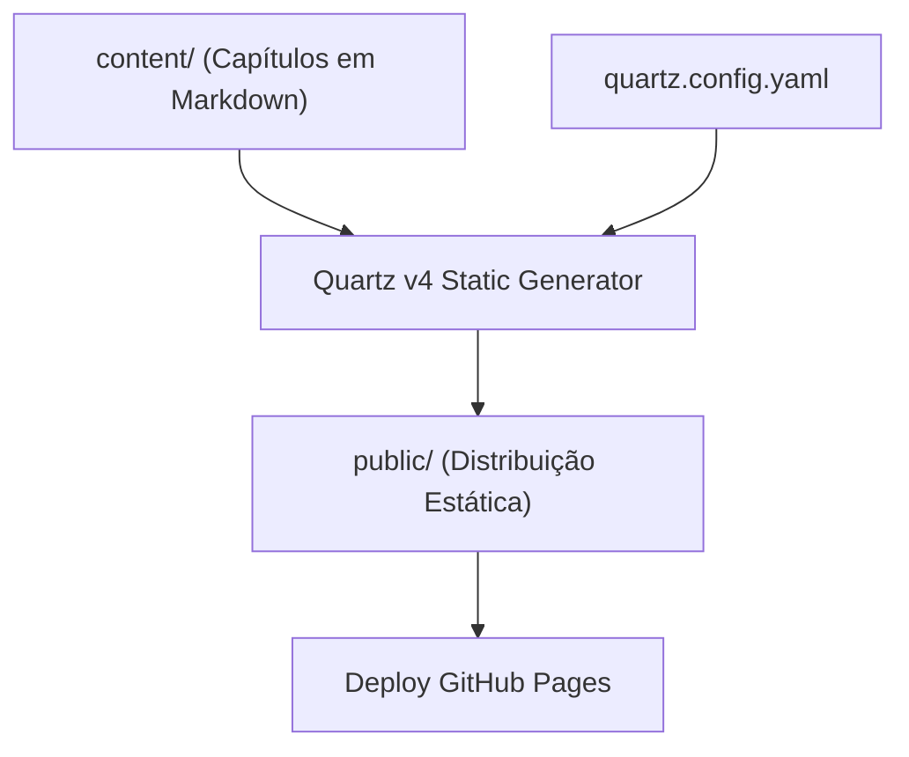

# DESIGN — DevOps Guide Architecture & Design Rules

## 1. Arquitetura do Guia

---

## 2. Princípios de Redação e Padronização

1. **Rigor em Comandos:**
   - Todo comando Git e shell deve ser testado e acompanhado de explicação de impacto e bandeiras (flags).
2. **Conventional Commits Obrigatórios:**
   - Validação automatizada via hook ou script `validate-commit-msg.sh`.
