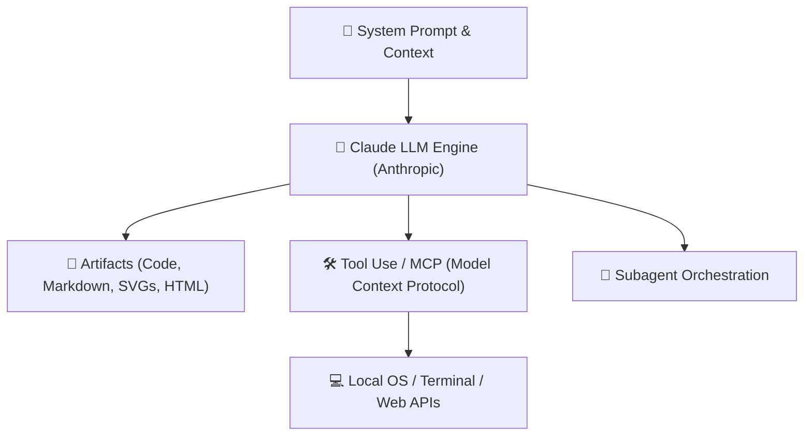

# 🤖 Claude & AI Engineering: Theory to Agents

> [!NOTE]
> **Module Status**: Actively expanding. The Anthropic Claude family (Claude 3.5 Sonnet, Claude 3 Opus, Claude 3.7) has set the standard in software reasoning, instruction adherence, and extended context window execution (200k+ tokens).

---

## 🧭 Claude Interaction Architecture

---

## 🗺️ Topics & Module Roadmap

1. **Claude Model Family & Constitutional AI**:
   - Model selection trade-offs (Sonnet for code, Opus for complex reasoning, Haiku for speed/cost).
2. **Advanced Prompt Engineering for Codebases**:
   - XML tag delimiters (`<context>`, `<guidelines>`, `<instructions>`).
   - Chain-of-Thought prompting, deterministic verification, and hallucination reduction.
3. **Context Window Optimization & Prompt Caching**:
   - Up to 90% cost reduction and 85% latency reduction using Anthropic Prompt Caching.
4. **Claude Code CLI & Pair Programming**:
   - Terminal-native agent workflows for multi-file refactoring and test generation.
5. **Tool Use & MCP (Model Context Protocol)**:
   - Connecting Claude models to external servers, filesystems, and databases.

---

## 🔗 Second Brain Links

- Autonomous agent skill authoring in [[en/hermes/index|Hermes Agent & Skills]].
- Integrate AI in GitHub workflows with [[en/github/github-flow-processes|Workflows: Issues, PRs & Governance]].
- Back to the central hub in [[en/index|Second Brain Docs Hub]].
