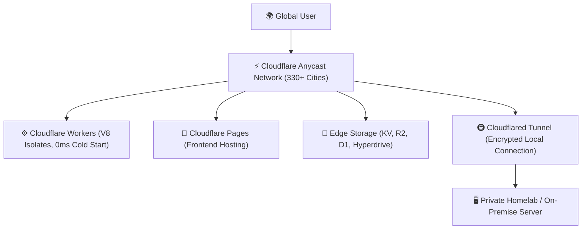

# ⚡ Cloudflare Ecosystem: Edge, Serverless & Security

> [!NOTE]
> **Module Status**: Actively expanding. Cloudflare has evolved from a CDN and DDoS protection network into the fastest global edge computing and serverless platform in the world.

---

## 🧭 Cloudflare Edge Architecture

---

## 🗺️ Topics & Module Roadmap

1. **Cloudflare Workers**:
   - V8 Isolates architecture vs. containerized micro-VM Lambdas.
   - Zero cold start, sub-millisecond invocation, and Wrangler CLI workflows.
2. **Cloudflare Pages**:
   - Continuous deployment of static/JAMstack frontends with branch previews.
3. **Edge Storage Primitives**:
   - **Workers KV**: High-read low-latency key-value store.
   - **Cloudflare R2**: Zero-egress fee S3-compatible object storage.
   - **Cloudflare D1**: Serverless relational SQLite at the edge.
4. **Cloudflare Tunnels (`cloudflared`)**:
   - Exposing internal services securely without public IPv4 or open router ports.

---

## 📚 Official Documentation & References

- 🌐 [Cloudflare Developers Documentation](https://developers.cloudflare.com/) — Official Cloudflare edge documentation.
- ⚡ [Cloudflare Workers & V8 Isolates](https://developers.cloudflare.com/workers/) — Sub-millisecond serverless compute.
- 🛡️ [Cloudflare Zero Trust & Tunnels](https://developers.cloudflare.com/cloudflare-one/) — Secure perimeter-less networking.

---

## 🔗 Second Brain Links

- Deploy documentation sites with [[en/github/github-pages-quartz|GitHub Pages & Quartz v4]].
- Automate edge deployments in [[en/github/github-actions-cicd|GitHub Actions & CI/CD]].
- Back to the central hub in [[en/index|Second Brain Docs Hub]].
