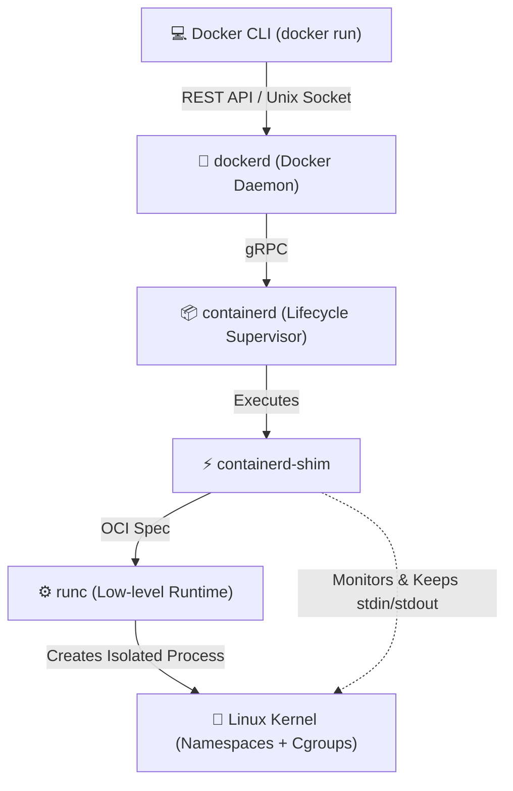
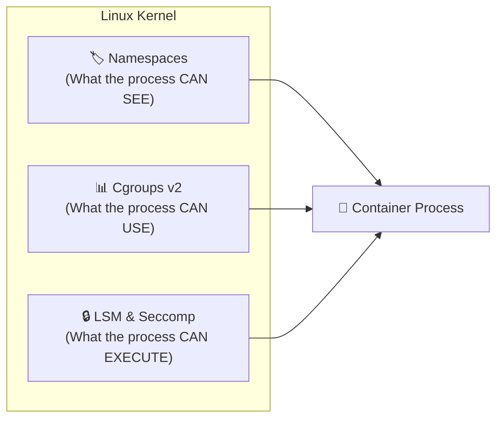
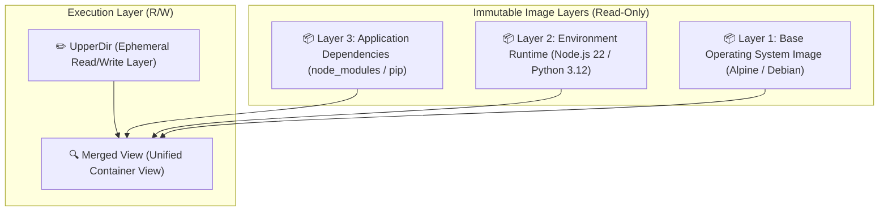

# ⚙️ Docker Engine Architecture & Internals

> [!NOTE]
> A container is **not a virtual machine**. Containers are simply **standard Linux processes** isolated through native kernel primitives: *Namespaces* (system visibility), *Control Groups* (resource limits), and *OverlayFS* (layered filesystems).

---

## 🏗️ 1. The Docker Execution Stack

Modern Docker follows the **OCI (Open Container Initiative)** specification and decouples its architecture into modular layers:



### Architectural Components:
1. **Docker Daemon (`dockerd`)**: Exposes high-level REST APIs, manages images, networks, volumes, and registry authentication.
2. **`containerd`**: Standalone daemon handling image transport, container lifecycle, and process supervision.
3. **`containerd-shim`**: Lightweight helper process running alongside the container to keep file descriptors open (stdin, stdout, stderr) even if the main daemon restarts.
4. **`runc`**: OCI reference implementation that executes direct kernel system calls (*syscalls* like `clone`, `unshare`, `pivot_root`).

---

## 🛡️ 2. Linux Isolation Pillars



### 2.1. Linux Namespaces (Visibility Isolation)
| Namespace | What it Isolate | Practical Effect on Container |
| :--- | :--- | :--- |
| **`pid`** | Process Tree | The main process sees itself as `PID 1`. |
| **`net`** | Network Interfaces & Ports | Each container gets its own loopback, virtual IP, and routing table. |
| **`mnt`** | Mount Points | The container has its own root directory (`/`), isolated from the host. |
| **`ipc`** | Inter-Process Communication | Blocks shared memory and message queues with other containers. |
| **`uts`** | Hostname & Domain | Allows the container to set its independent hostname. |
| **`user`** | UID / GID Mappings | Maps root inside the container to an unprivileged user on the host. |

### 2.2. Control Groups (Cgroups v2)
While namespaces isolate visibility, **Cgroups** enforce physical limits on machine resources:
- **CPU**: CPU execution quotas (`cpu.max`) and core affinity.
- **Memory**: Hard limits (`memory.max`), soft thresholds (`memory.high`), and OOM (*Out Of Memory Killer*) protection.
- **Disk I/O**: IOPS throttling and read/write bandwidth caps on NVMe/SSD disks.

---

## 🗂️ 3. Layered Storage Driver: Overlay2

Docker utilizes the **OverlayFS (overlay2)** storage driver to merge container filesystems without disk data duplication:



### Copy-on-Write (CoW) Mechanics:
- When a container reads an unchanged file, reading happens directly from immutable image layers (*LowerDir*).
- When a container modifies or deletes an existing file, the kernel copies the file into the ephemeral writable layer (*UpperDir*) before modification. The base image layers remain 100% immutable.

---

## 🔬 4. Inspecting Containers in the Terminal

Advanced commands for kernel-level inspection on Linux hosts:

```bash
# Run an isolated container with 512MB RAM and 1 CPU cap
docker run -d --name isolated-app --memory=512m --cpus=1.0 alpine sleep 3600

# Get real container process PID on the host
CONTAINER_PID=$(docker inspect --format '{{.State.Pid}}' isolated-app)
echo "Host PID: $CONTAINER_PID"

# Inspect active Namespaces
ls -l /proc/$CONTAINER_PID/ns/

# Inspect Cgroups v2 resource boundaries
cat /sys/fs/cgroup/system.slice/docker-*.scope/memory.max 2>/dev/null || cat /sys/fs/cgroup/memory/docker/$CONTAINER_PID/memory.limit_in_bytes 2>/dev/null
```

---

## 🔗 Second Brain Connections

- [[en/docker/dockerfile-multistage-best-practices|Advanced Multi-Stage Dockerfile Best Practices]]
- [[en/docker/docker-compose-production|Production Orchestration with Docker Compose]]
- [[en/github/github-security-snyk-sonar|Container Security & Vulnerability Auditing]]
