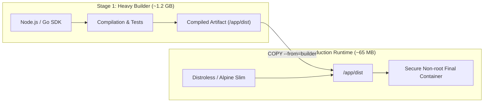

# 📦 Production Multi-Stage Dockerfile Patterns

> [!TIP]
> Production images should contain **only the compiled application binary and runtime dependencies**. Build toolchains (C++ compilers, TypeScript CLIs, development SDKs) must be discarded via **Multi-Stage Builds**, reducing image footprints from gigabytes to megabytes.

---

## 🏗️ 1. How Multi-Stage Builds Work



---

## 💻 2. Production Node.js / TypeScript Dockerfile

```dockerfile
# syntax=docker/dockerfile:1.4
# ==========================================
# STAGE 1: Dependency Installation
# ==========================================
FROM node:22-alpine AS deps
RUN apk add --no-cache libc6-compat
WORKDIR /app

# Copy only manifests to maximize layer cache
COPY package.json package-lock.json ./
RUN npm ci --frozen-lockfile

# ==========================================
# STAGE 2: Build & Transpilation
# ==========================================
FROM node:22-alpine AS builder
WORKDIR /app
COPY --from=deps /app/node_modules ./node_modules
COPY . .

# Disable telemetry and build
ENV NODE_ENV=production
RUN npm run build && npm prune --production

# ==========================================
# STAGE 3: Production Runtime
# ==========================================
FROM node:22-alpine AS runner
WORKDIR /app

ENV NODE_ENV=production
ENV PORT=3000

# Create unprivileged non-root user
RUN addgroup --system --gid 1001 nodejs && \
    adduser --system --uid 1001 nodejsuser

# Copy strictly required files from builder
COPY --from=builder /app/package.json ./package.json
COPY --from=builder --chown=nodejsuser:nodejs /app/node_modules ./node_modules
COPY --from=builder --chown=nodejsuser:nodejs /app/dist ./dist

USER nodejsuser

EXPOSE 3000

# Native healthcheck
HEALTHCHECK --interval=30s --timeout=3s --start-period=5s --retries=3 \
  CMD wget --no-verbose --tries=1 --spider http://localhost:3000/health || exit 1

CMD ["node", "dist/index.js"]
```

---

## 🎯 3. The 6 Golden Rules of Production Images

### 1. Optimize Layer Cache Order
Place rarely changing commands (`COPY package*.json`, `RUN npm ci`) **before** frequently changing instructions (`COPY . .`).

### 2. Always Use a Strict `.dockerignore`
Never ship local cache, credentials, or temporary files into the build daemon:

```text
# .dockerignore
node_modules
.git
.github
*.log
.env*
dist
build
coverage
.DS_Store
```

### 3. Never Run Containers as `root`
Always create and switch to an unprivileged system user (`USER appuser`) to mitigate container breakout vulnerabilities.

### 4. Rely on Minimal Base Images
Prefer `-alpine`, `-slim`, or **Google Distroless** images (`gcr.io/distroless/nodejs22-debian12`).

### 5. Leverage Docker BuildKit
Enable parallel stage execution and secret mounts:
```bash
DOCKER_BUILDKIT=1 docker build -t my-app:prod .
```

---

## 🔗 Second Brain Connections

- [[en/docker/docker-architecture-engine|Docker Engine Architecture & Internals]]
- [[en/docker/docker-compose-production|Production Orchestration with Docker Compose]]
- [[en/github/github-security-snyk-sonar|Container Security & Vulnerability Auditing]]
