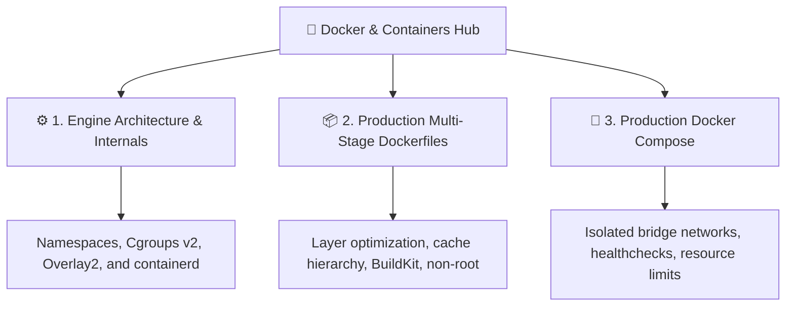

# 🐳 Docker & Containers Hub

> [!NOTE]
> Welcome to the **Docker & Containers Hub**. This pillar delivers re-explained, production-grade technical guides, breaking down low-level Linux kernel isolation primitives all the way to complete resilient multi-container architectures.

---

## 🗺️ Module Navigation Map

---

## 📚 Available In-Depth Guides

1. [[en/docker/docker-architecture-engine|⚙️ Docker Engine Architecture & Internals]]
   - The OCI runtime stack: `dockerd`, `containerd`, `containerd-shim`, and `runc`.
   - Linux isolation primitives: Namespaces (`pid`, `net`, `mnt`, `ipc`, `user`) and Cgroups v2.
   - Layered storage mechanics with `overlay2` and Copy-on-Write.

2. [[en/docker/dockerfile-multistage-best-practices|📦 Production Multi-Stage Dockerfile Patterns]]
   - Build vs runtime stage separation using Alpine and Distroless base images.
   - Layer caching optimization strategies and `.dockerignore` discipline.
   - Running as non-root system users.

3. [[en/docker/docker-compose-production|🐙 Production Orchestration with Docker Compose]]
   - Multi-tier network isolation (*frontend-net* vs *backend-net*).
   - Robust `healthcheck` declarations and `depends_on` conditions.
   - CPU and Memory resource enforcement.

---

## 📚 Official Documentation & References

- 🌐 [Docker Engine Official Documentation](https://docs.docker.com/engine/) — Official architecture, CLI, and storage drivers.
- 📦 [Open Container Initiative (OCI) Runtime Spec](https://github.com/opencontainers/runtime-spec) — Technical spec for runc and containerd.
- 🐙 [Docker Compose Specification](https://docs.docker.com/compose/compose-file/) — Official compose.yaml standard.
- 🐧 [Linux Kernel: Cgroups v2 & Namespaces](https://www.kernel.org/doc/Documentation/cgroup-v2.txt) — Official kernel documentation.

---

## 🔗 Second Brain Connections

- [[en/github/github-actions-cicd|CI/CD with GitHub Actions: Building & Publishing Container Images]]
- [[en/github/github-security-snyk-sonar|Container Security: Snyk & SonarCloud Scanning]]
- [[en/cloudflare/index|Cloudflare Hub: Edge Containers & Cloudflare Tunnels]]
