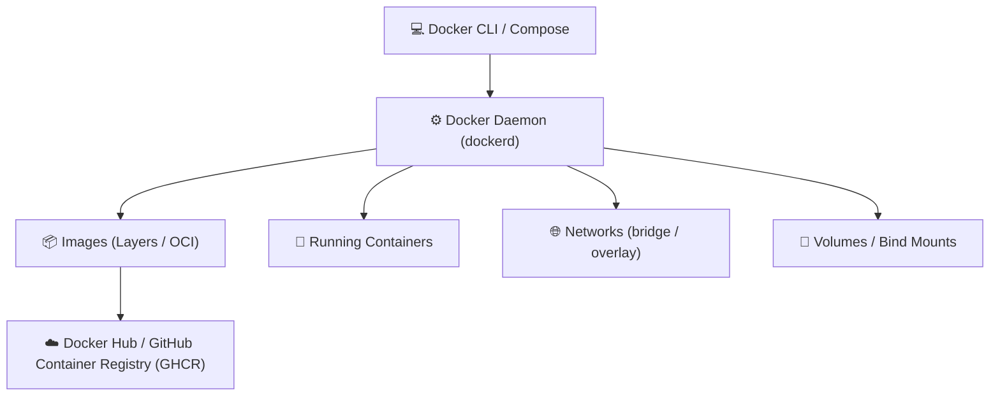

# 🐳 Docker & Containers: Architecture & Practical Guide

> [!NOTE]
> **Module Status**: Actively expanding. This pillar covers transitioning monolithic applications into OCI containerized services, optimizing production images, and local multi-service orchestration.

---

## 🧭 Docker Ecosystem Overview

---

## 🗺️ Topics & Module Roadmap

1. **Docker Fundamentals**:
   - Linux kernel primitives: *Namespaces*, *cgroups*, and *UnionFS*.
   - Hypervisor Virtual Machines vs. OS-level Containerization.
2. **Optimized Dockerfile Authoring**:
   - Multi-stage builds reducing image footprints from ~1GB to <50MB.
   - Layer caching strategies and non-root security (`USER appuser`).
3. **Local Orchestration with Docker Compose**:
   - Managing multi-container stacks, networks, volumes, `.env`, and healthchecks.
4. **Networking & Volume Persistence**:
   - Bridge, host, overlay networks and named volume lifecycle.
5. **CI/CD Automation**:
   - Automated image building and pushing to GHCR via [[en/github/github-actions-cicd|GitHub Actions]].

---

## 🔗 Second Brain Links

- Automate container tests in [[en/github/github-actions-cicd|GitHub Actions & CI/CD]].
- Scan Docker images for vulnerabilities with [[en/github/github-security-snyk-sonar|Security & Code Quality]].
- Back to the central hub in [[en/index|Second Brain Docs Hub]].
