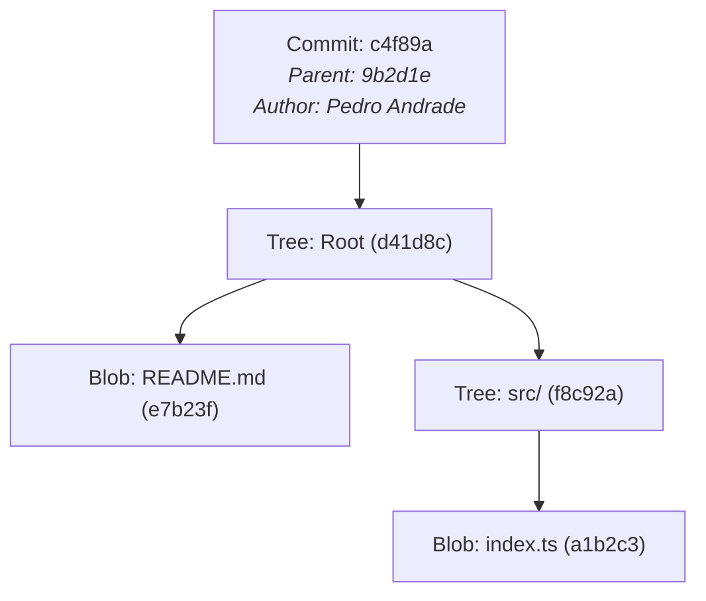
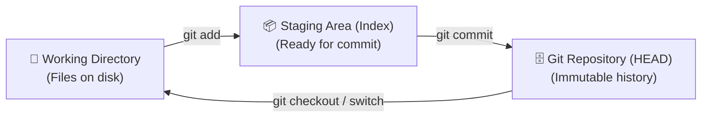
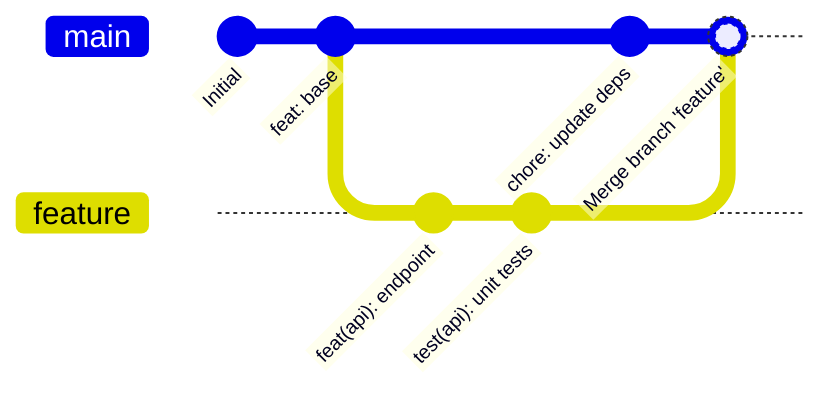

# ⚙️ Git Essentials & Internal Mechanics

> [!NOTE]
> Git is not merely a file synchronization tool; it is a **Content-Addressable Object Database** with a VCS filesystem layer on top. Understanding how Git works under the hood removes all friction when running advanced commands like `rebase`, `reset`, and `reflog`.

---

## 🏗️ 1. Git Internal Architecture

Git stores all repository history inside the hidden `.git/` directory. Under the hood, there are four primary object types, identified by a cryptographic SHA-1 (or SHA-256) hash:

1. **Blob**: Stores raw file content (without filename or permission metadata).
2. **Tree**: Represents a directory. Maps filenames to Blob hashes or nested Trees.
3. **Commit**: Contains a pointer to a root Tree, commit metadata (author, committer, timestamp, message), and the parent commit hash.
4. **Annotated Tag**: A permanent pointer to a specific commit with an attached message and cryptographic signature.



---

## 🗂️ 2. The Three Working Areas

Data transitions between three fundamental states in Git:



- **Working Directory**: Your actual files on disk where modifications happen.
- **Staging Area (Index)**: A prepared snapshot of selected changes queued for the next commit.
- **Repository (HEAD)**: The immutable record containing the complete commit history.

---

## 🌿 3. Branch Strategies: Merge vs. Rebase

When integrating changes from a feature branch into the mainline (`main`), there are two primary philosophies:



### When to use Merge:
- Preserves the full non-linear history and exact chronology of when branches were created and joined.
- Completely safe for public branches shared across multiple engineers.
- Command:
  ```bash
  git checkout main
  git merge feature/new-feature --no-ff
  ```

### When to use Rebase:
- Re-applies your branch commits on top of `main`, producing a strictly linear and clean history.
- Ideal for cleaning up local commits before submitting a Pull Request.
- Command:
  ```bash
  git checkout feature/new-feature
  git rebase main
  ```

> [!WARNING]
> **The Golden Rule of Rebasing**: NEVER rebase commits that exist outside your local repository and have been pushed to a shared public branch. Only rebase your local feature branches.

---

## 🛠️ 4. Quick Guide to Essential & Advanced Commands

### 4.1. Stash: Temporary Work Storage
Saves uncommitted modifications so you can switch contexts immediately:

```bash
# Save changes with a descriptive message (including untracked files)
git stash push -u -m "WIP: login route adjustment"

# List all saved stashes
git stash list

# Apply the latest stash and drop it from the stack
git stash pop

# Apply a specific stash without dropping it
git stash apply stash@{1}
```

---

### 4.2. Cherry-Pick: Atomic Commit Porting
Applies changes introduced by a specific commit from another branch onto the current branch:

```bash
# Apply a single commit
git cherry-pick <commit-sha>

# Apply a sequential range of commits
git cherry-pick <start-sha>..<end-sha>

# Stage the changes without auto-committing
git cherry-pick -n <commit-sha>
```

---

### 4.3. Reset vs. Revert: Undoing Changes

| Action | `git reset` | `git revert` |
| :--- | :--- | :--- |
| **Mechanism** | Moves branch pointer backwards (rewrites history). | Creates a new commit applying the inverted diff. |
| **Safety** | Safe only on private local branches. | 100% safe on public branches and production. |
| **Typical Use** | Discard unpushed local mistakes. | Roll back a buggy deployment in production. |

```bash
# Soft reset (keeps modified files staged in Index)
git reset --soft HEAD~1

# Mixed reset (default: unstages files, keeps changes in Working Directory)
git reset HEAD~1

# Hard reset (destructive: discards all changes)
git reset --hard HEAD~1

# Safe revert (creates a new inverse commit)
git revert <commit-sha>
```

---

### 4.4. Reflog: The Ultimate Safety Net
Git maintains a local journal (`reflog`) of every time `HEAD` changes position. Even if you run an accidental `git reset --hard`, your commits remain on disk for up to 30 days.

```bash
# View HEAD movement history
git reflog

# Sample output:
# 9a2b3c1 HEAD@{0}: reset: moving to HEAD~2
# 8f1e2d3 HEAD@{1}: commit: feat(auth): add jwt middleware
# 7c4b5a6 HEAD@{2}: commit: fix(api): validation bug

# Restore to the state before the reset:
git reset --hard HEAD@{1} # or git reset --hard 8f1e2d3
```

---

### 4.5. Bisect: Binary Bug Hunting
Pinpoint the exact commit that introduced a regression using binary search:

```bash
git bisect start
git bisect bad                 # Current commit is broken
git bisect good v1.0.0         # Tag v1.0.0 was working perfectly

# Git automatically checks out intermediate commits.
# Test the app and declare:
git bisect good # or git bisect bad

# When done:
git bisect reset
```

---

## 🔗 Second Brain Links

- Format your commits consistently with [[en/github/conventional-commits|Conventional Commits]].
- Structure team collaboration with [[en/github/github-flow-processes|Workflows: Issues, PRs & Governance]].
- Automate branch validation with [[en/github/github-actions-cicd|GitHub Actions & CI/CD]].
