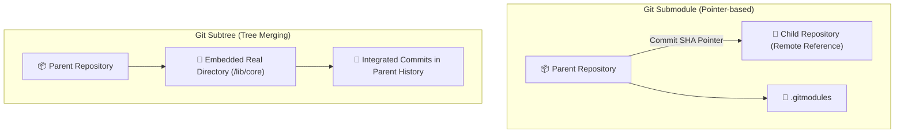

# 🌳 Git Submodules vs Git Subtrees: Nested Repositories

> [!NOTE]
> When a project needs to reuse code from another Git repository (a shared library, an infrastructure template, or modular docs), Git provides two primary architectural strategies: **Submodules** (pointer-based by commit SHA) and **Subtrees** (direct tree merging into commit history).

---

## 🏗️ 1. Architectural Comparison: Submodule vs Subtree



| Metric | Git Submodule | Git Subtree |
| :--- | :--- | :--- |
| **Storage Model** | Stores only commit SHA-1 pointer and URL in `.gitmodules`. | Copies all files and history directly into parent repository. |
| **Downstream Cloning** | Requires `git submodule update --init --recursive`. | Completely transparent: standard `git clone` gets everything. |
| **Operational Friction** | High (*detached HEAD* states, unpushed inner commits). | Low for consumers, moderate for upstream syncing. |
| **Best Used For** | Strictly decoupled external components versioned by release tags. | Shared codebases where developers frequently edit locally. |

---

## 💻 2. Practical Guide: Git Submodules

### Adding a Submodule:
```bash
# Adds repository as submodule in 'plugins/my-plugin'
git submodule add https://github.com/user/my-plugin.git plugins/my-plugin

# Inspect generated metadata
cat .gitmodules
```

### Cloning Projects with Submodules:
```bash
# Recursive clone (fetches parent and all submodules automatically)
git clone --recurse-submodules https://github.com/user/devops-guide.git

# Or initialize after regular clone:
git submodule update --init --recursive
```

### Updating Submodules to Latest Remote Commits:
```bash
git submodule update --remote --merge
```

---

## 🌲 3. Practical Guide: Git Subtrees

Git Subtree is built into Git core and requires no auxiliary config files:

### Adding a Subtree:
```bash
git subtree add --prefix=libs/auth https://github.com/user/auth-lib.git main --squash
```

### Pulling Upstream Subtree Updates:
```bash
git subtree pull --prefix=libs/auth https://github.com/user/auth-lib.git main --squash
```

### Pushing Local Subtree Commits Back Upstream:
```bash
git subtree push --prefix=libs/auth https://github.com/user/auth-lib.git main
```

---

## ⚠️ 4. Common Pitfalls & Best Practices

1. **Submodule Detached HEAD**: Submodules point to frozen commit hashes. If editing code inside a submodule, always checkout a named branch (`git checkout main`) before committing.
2. **GitHub Actions CI/CD**: Ensure recursive checkout is enabled in pipelines:
```yaml
- uses: actions/checkout@v4
  with:
    submodules: recursive
    token: ${{ secrets.PAT_GITHUB }} # Required for private submodules
```

---

## 📚 Official Documentation & References

- 🌐 [Git SCM Official Documentation](https://git-scm.com/doc) — Official Pro Git book and command manual.
- 🐙 [GitHub Docs](https://docs.github.com/) — Official guides on GitHub Actions, PRs, Security, and REST/GraphQL APIs.
- 📦 [Conventional Commits 1.0.0 Specification](https://www.conventionalcommits.org/en/v1.0.0/) — Official specification.
- 🛡️ [SonarCloud Documentation](https://docs.sonarcloud.io/) & [Snyk Docs](https://docs.snyk.io/) — Official SAST & SCA security docs.

---

## 🔗 Second Brain Connections

- [[en/github/git-essentials|Git Essentials & Internal Mechanics]]
- [[en/github/github-flow-processes|Pull Request Workflows & Governance]]
- [[en/github/github-actions-cicd|CI/CD with GitHub Actions & Caching]]
