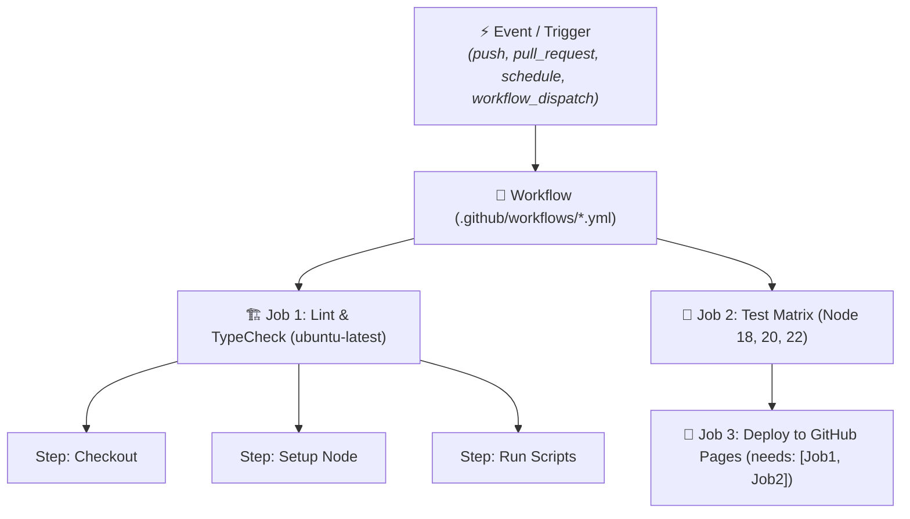

# 🚀 GitHub Actions & Automated CI/CD

> [!NOTE]
> **GitHub Actions** turns your repository into a complete automation engine capable of building, testing, linting, auditing security, and deploying software directly in response to any Git lifecycle event.

---

## 🏛️ 1. GitHub Actions Architecture



### Core Concepts:
1. **Workflows**: Declarative YAML configuration files in `.github/workflows/`.
2. **Events (Triggers)**: Events that kick off a workflow run (`push`, `pull_request`, `workflow_dispatch`, `release`, `schedule`).
3. **Jobs**: Sets of steps executed on the same runner machine. Jobs run concurrently by default.
4. **Runners**: Virtual machine environments hosted by GitHub (`ubuntu-latest`, `windows-latest`, `macos-latest`) or self-hosted.
5. **Steps & Actions**: Individual shell tasks (`run: ...`) or packaged community actions (`uses: actions/checkout@v4`).

---

## 🌐 2. Production Workflow: Deploy Quartz to GitHub Pages

This repository uses the following battle-tested workflow in `.github/workflows/deploy-gh-pages.yaml`:

```yaml
name: Deploy to GitHub Pages

on:
  push:
    branches:
      - main
  workflow_dispatch:

permissions:
  contents: read
  pages: write
  id-token: write

concurrency:
  group: "pages"
  cancel-in-progress: true

jobs:
  build:
    runs-on: ubuntu-latest
    steps:
      - name: Checkout Repository
        uses: actions/checkout@v4
        with:
          fetch-depth: 0

      - name: Setup Node.js 22
        uses: actions/setup-node@v4
        with:
          node-version: 22

      - name: Install Dependencies
        run: npm ci

      - name: Install Quartz Plugins
        run: npx quartz plugin install

      - name: Build Quartz
        run: npx quartz build

      - name: Configure GitHub Pages
        uses: actions/configure-pages@v4

      - name: Upload Artifact
        uses: actions/upload-pages-artifact@v3
        with:
          path: public

  deploy:
    environment:
      name: github-pages
      url: ${{ steps.deployment.outputs.page_url }}
    runs-on: ubuntu-latest
    needs: build
    steps:
      - name: Deploy to GitHub Pages
        id: deployment
        uses: actions/deploy-pages@v4
```

---

## 📚 Official Documentation & References

- 🌐 [Git SCM Official Documentation](https://git-scm.com/doc) — Official Pro Git book and command manual.
- 🐙 [GitHub Docs](https://docs.github.com/) — Official guides on GitHub Actions, PRs, Security, and REST/GraphQL APIs.
- 📦 [Conventional Commits 1.0.0 Specification](https://www.conventionalcommits.org/en/v1.0.0/) — Official specification.
- 🛡️ [SonarCloud Documentation](https://docs.sonarcloud.io/) & [Snyk Docs](https://docs.snyk.io/) — Official SAST & SCA security docs.

---

## 🔗 Second Brain Links

- Publish and customize documentation sites with [[en/github/github-pages-quartz|GitHub Pages & Quartz v4]].
- Integrate security and quality gates with [[en/github/github-security-snyk-sonar|Security & Code Quality]].
- Trigger workflows remotely with [[en/github/github-cli-api|GitHub CLI & API]].
