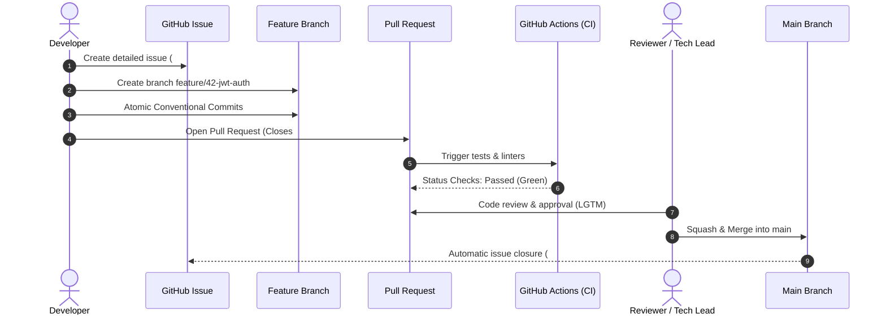

# 👥 Workflows: Issues, PRs & Governance

> [!NOTE]
> High-velocity engineering teams rely on low-friction, predictable workflows. This document standardizes the end-to-end lifecycle of **Issues**, **Pull Requests (PRs)**, **Code Reviews**, and **Branch Governance**.

---

## 🧭 1. Change Lifecycle (GitHub Flow)



---

## 📋 2. Issue Standardization

### 2.1. Title Naming Convention
Prefix issue titles with the task type:
- `bug: auth failure when refreshing expired token`
- `feat: add CSV report export`
- `docs: update quick start instructions in README`
- `infra: upgrade CI runner to Ubuntu 24.04`

### 2.2. Label Taxonomy

| Category | Typical Labels | Meaning |
| :--- | :--- | :--- |
| **Type** | `bug`, `enhancement`, `documentation`, `refactor` | Technical nature of the task |
| **Priority** | `priority: critical`, `priority: high`, `priority: low` | Urgency of resolution |
| **Status** | `status: in-progress`, `status: blocked`, `needs-review` | Lifecycle state |
| **Community** | `good first issue`, `help wanted` | Ideal for external contributors |

---

## 🔀 3. Pull Request Anatomy

### 3.1. Branch Naming
Create branches from an up-to-date `main`:
- `feat/<ticket>-short-description` (e.g., `feat/102-category-filters`)
- `fix/<ticket>-short-description` (e.g., `fix/88-worker-memory-leak`)
- `docs/<short-description>` (e.g., `docs/revise-readme`)
- `refactor/<short-description>` (e.g., `refactor/modularize-auth`)

### 3.2. PR Body Structure (`PULL_REQUEST_TEMPLATE.md`)

```markdown
## 📌 Description
Replaces legacy date parsing logic with `date-fns`, reducing bundle size by 45KB and adding Latin America timezone support.

## 🎯 Motivation & Context
Resolves performance degradation reported in issue #45 and financial report timezone mismatch.

## 🧪 Testing Steps
1. Start app locally with `npm run dev`.
2. Navigate to `/reports/closing`.
3. Select date range 01/01 to 01/31 and verify UTC-3 formatting.
4. Run automated test suite: `npm test`.

## 📋 Validation Checklist
- [x] Unit tests added/updated
- [x] Linting and formatting verified (`npm run check`)
- [x] Documentation updated
- [x] Conventional Commits adhered to
- [x] No security warnings or vulnerable packages

## 🔗 Related Issues
Closes #45
```

---

## 🛡️ 4. Branch Protection & Governance

Protect the `main` branch with these rules:
1. **Require a pull request before merging**: Disallows direct pushes to `main`.
2. **Require approvals**: Enforces at least 1 designated code review approval.
3. **Dismiss stale pull request approvals when new commits are pushed**: Guarantees new changes are re-reviewed.
4. **Require status checks to pass before merging**: Blocks merges until CI passes.
5. **Require linear history**: Enforces clean Squash & Merge or Rebase workflows.

---

## 🔗 Second Brain Links

- Ensure clean commits with [[en/github/conventional-commits|Conventional Commits]].
- Configure required CI checks in [[en/github/github-actions-cicd|GitHub Actions & CI/CD]].
- Set up automatic vulnerability scanning in [[en/github/github-security-snyk-sonar|Security & Code Quality]].
