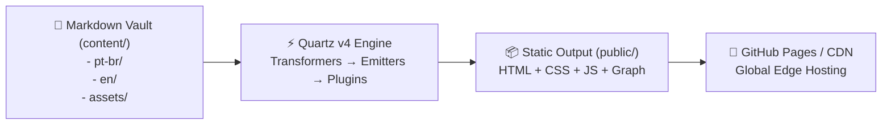

# 🌐 Digital Gardens with Quartz v4 & GitHub Pages

> [!NOTE]
> A **Digital Garden** is an interconnected network of technical knowledge, mental models, and architectural references. Unlike linear chronological blogs, a digital garden is explored through **conceptual graph connections**, bidirectional wikilinks, and topical hubs.

---

## ⚡ 1. What is Quartz v4?

**Quartz v4** is a high-performance static site generator (SSG) powered by **Node.js, Preact, TypeScript, and esbuild/lightningcss**. It compiles Markdown vaults with YAML frontmatter, resolves Obsidian-style wikilinks (`[[note]]`), renders interactive D3 knowledge graphs, and outputs ultra-fast static HTML.



---

## 🌍 2. Mirrored Multilingual Architecture (PT-BR / EN-US)

To maintain a frictionless bilingual digital garden:
1. **Locale folders in `content/`**:
   - `content/pt-br/module/topic.md`
   - `content/en/module/topic.md`
2. **Strict Slug Mirroring**:
   - File and folder names match 1:1 across languages.
   - The `LanguageToggle.tsx` component instantly swaps the active locale between `/pt-br/` and `/en/` without broken links or 404s.
3. **Explorer Language Flattening**:
   - CSS rules in `custom.scss` hide the root folder of inactive languages and un-indent active folders so topics appear cleanly as top-level sidebar items.

---

## 🚀 3. Local Development Commands

```bash
# Install dependencies
npm install

# Install Quartz community plugins
npx quartz plugin install

# Start local live-reload server (http://localhost:8080)
npm run serve

# Production static build
npm run build

# Typecheck TypeScript files
npm run check
```

---

## 📚 Official Documentation & References

- 🌐 [Git SCM Official Documentation](https://git-scm.com/doc) — Official Pro Git book and command manual.
- 🐙 [GitHub Docs](https://docs.github.com/) — Official guides on GitHub Actions, PRs, Security, and REST/GraphQL APIs.
- 📦 [Conventional Commits 1.0.0 Specification](https://www.conventionalcommits.org/en/v1.0.0/) — Official specification.
- 🛡️ [SonarCloud Documentation](https://docs.sonarcloud.io/) & [Snyk Docs](https://docs.snyk.io/) — Official SAST & SCA security docs.

---

## 🔗 Second Brain Links

- Configure automated publishing in [[en/github/github-actions-cicd|GitHub Actions & CI/CD]].
- Learn doc authoring standards in [[../../skills/doc-authoring/SKILL|Documentation Authoring Skill]].
- Graph network topology curation in [[../../skills/second-brain-graph/SKILL|Second Brain Graph Skill]].
