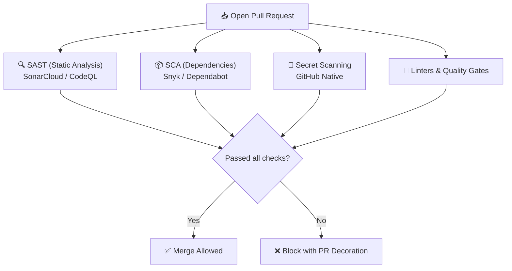

# 🛡️ Security & Code Quality: Snyk, SonarCloud & CodeQL

> [!NOTE]
> **DevSecOps** embraces *Shift-Left Security* — finding and remediating security vulnerabilities, architectural flaws, and technical debt the exact moment code is written and submitted in a Pull Request.

---

## 🎯 1. The Four Continuous Audit Pillars



1. **SAST (Static Application Security Testing)**: Scans source code for logic bugs, SQL injections, XSS, and code smells (SonarCloud, CodeQL).
2. **SCA (Software Composition Analysis)**: Scans direct and transitive dependencies for known CVEs (Snyk, Dependabot).
3. **Secret Scanning**: Prevents accidental commits of API tokens, certificates, and credentials.
4. **Quality Gates**: Automated merge blocks if test coverage decreases or technical debt increases.

---

## ☁️ 2. SonarCloud: Quality & Quality Gates

SonarCloud provides managed continuous inspection of code quality and security.

### Key Metrics Evaluated:
- **Bugs**: Runtime exceptions waiting to happen.
- **Vulnerabilities**: Direct security exposures.
- **Security Hotspots**: Sensitive security code requiring human review (e.g. cryptography, complex regexes).
- **Code Smells**: Maintainability degradations.
- **Coverage**: Target at least 80% coverage on new code.

---

## 🐶 3. Snyk: Dependency & Container Security

Snyk scans third-party packages, Docker images, and Terraform/Kubernetes configurations.

### Local CLI Testing:
```bash
# Install Snyk CLI
npm install -g snyk

# Authenticate
snyk auth

# Test current folder dependencies
snyk test

# Monitor continuous snapshots
snyk monitor

# Test a local Docker image
snyk container test my-app:latest
```

---

## 🔗 Second Brain Links

- Combine security checks into your pipeline in [[en/github/github-actions-cicd|GitHub Actions & CI/CD]].
- Enforce pull request gating in [[en/github/github-flow-processes|Workflows: Issues, PRs & Governance]].
- Back to the main overview in [[en/github/index|GitHub & Git Ecosystem]].
