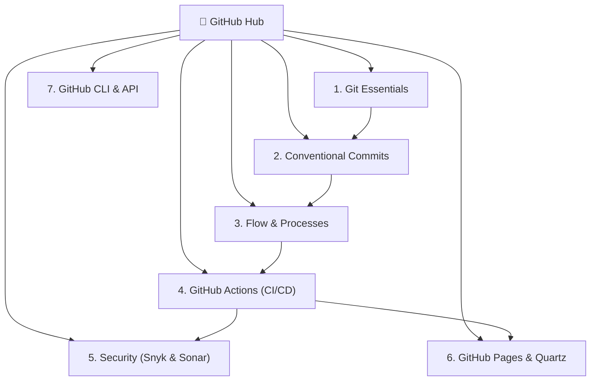

# 🐙 GitHub & Git Ecosystem: The Definitive Guide

> [!NOTE]
> This module re-explains all vital components for top-tier collaborative software engineering on GitHub. Each page delivers an in-depth conceptual overview, production-ready terminal commands, best practices, and real-world pitfalls.

---

## 📚 Learning Path & Modules

---

### 1. ⚙️ [[en/github/git-essentials|Git Essentials & Internal Mechanics]]
- Git object hierarchy: *Blobs, Trees, Commits, and Tags*.
- The three areas: *Working Directory, Staging Area (Index), and HEAD*.
- Branch management, Merge vs. Interactive Rebase strategies.
- Temporal manipulation: `git stash`, `git cherry-pick`, `git reset` (soft, mixed, hard), and disaster recovery via `git reflog`.

### 2. 🌳 [[en/github/git-submodules-subtrees|Git Submodules vs Git Subtrees: Nested Repositories]]
- Managing mono-repos and decoupled external dependencies.
- Pointer-based SHAs vs embedded tree merging.
- Essential recursive cloning and upstream sync commands.

### 3. 📝 [[en/github/conventional-commits|Conventional Commits & Semantic Messages]]
- Official Conventional Commits 1.0.0 specification.
- Full type taxonomy: `feat`, `fix`, `docs`, `style`, `refactor`, `perf`, `test`, `build`, `ci`, `chore`, `revert`.
- Strict formatting rules for *Header (Type, Scope, Subject)*, *Body*, and *Footer*.
- Communicating Breaking Changes (`!` and `BREAKING CHANGE:`).
- Automated bash script and Git hooks for commit message validation.

### 3. 👥 [[en/github/github-flow-processes|Workflows: Issues, PRs & Governance]]
- Issue opening standards with Markdown / YAML forms templates.
- Anatomy of an exemplary Pull Request: rich descriptions, checklists, testing steps, and auto-closing (`Closes #123`).
- Professional branch naming conventions (`feature/*`, `fix/*`, `refactor/*`).
- Repository governance: `CODEOWNERS`, Branch Protection Rules, mandatory reviewers, and Milestones.

### 4. 🚀 [[en/github/github-actions-cicd|GitHub Actions & Automated CI/CD]]
- Actions architecture: *Workflows, Events/Triggers, Jobs, Runners, and Steps*.
- Environment variables, managed Secrets, and OIDC Tokens.
- Pipeline optimizations: Dependency caching, Cross-platform matrix builds, and concurrency control.
- Reusable Workflows and Composite Actions for enterprise standardization.
- Automated continuous deployment to GitHub Pages.

### 5. 🛡️ [[en/github/github-security-snyk-sonar|Security & Code Quality: Snyk, SonarCloud & CodeQL]]
- Integrating SAST (Static Application Security Testing) and SCA (Software Composition Analysis).
- **SonarCloud**: Continuous analysis of code smells, test coverage, and *Quality Gates* enforcement.
- **Snyk**: Vulnerability scanning across dependencies, Docker images, and Infrastructure-as-Code.
- **GitHub Native Security**: Dependabot version/security updates, CodeQL, and Secret Scanning.

### 6. 🌐 [[en/github/github-pages-quartz|Digital Gardens with Quartz v4 & GitHub Pages]]
- Transforming Markdown vaults into lightning-fast static websites.
- `content/` folder structure with mirrored multilingual support (PT-BR / EN-US).
- Plugin configuration, real-time search, interactive Graph view, and dark/light modes.
- Automated build and publication workflow via GitHub Pages Actions.

### 7. 💻 [[en/github/github-cli-api|Productivity with GitHub CLI (`gh`) & APIs]]
- Managing Issues, Pull Requests, Releases, and Secrets directly from the terminal with `gh`.
- Automation and metrics extraction with GitHub REST API and GraphQL.
- Building custom extensions and terminal aliases.

---

> [!TIP]
> **Start from the basics**: If you want to master the workflow from the ground up, begin with [[en/github/git-essentials|Git Essentials]] and advance sequentially through the modules.

---

## 📚 Official Documentation & References

- 🌐 [Git SCM Official Documentation](https://git-scm.com/doc) — Official Pro Git book and command manual.
- 🐙 [GitHub Docs](https://docs.github.com/) — Official guides on GitHub Actions, PRs, Security, and REST/GraphQL APIs.
- 📦 [Conventional Commits 1.0.0 Specification](https://www.conventionalcommits.org/en/v1.0.0/) — Official specification.
- 🛡️ [SonarCloud Documentation](https://docs.sonarcloud.io/) & [Snyk Docs](https://docs.snyk.io/) — Official SAST & SCA security docs.
