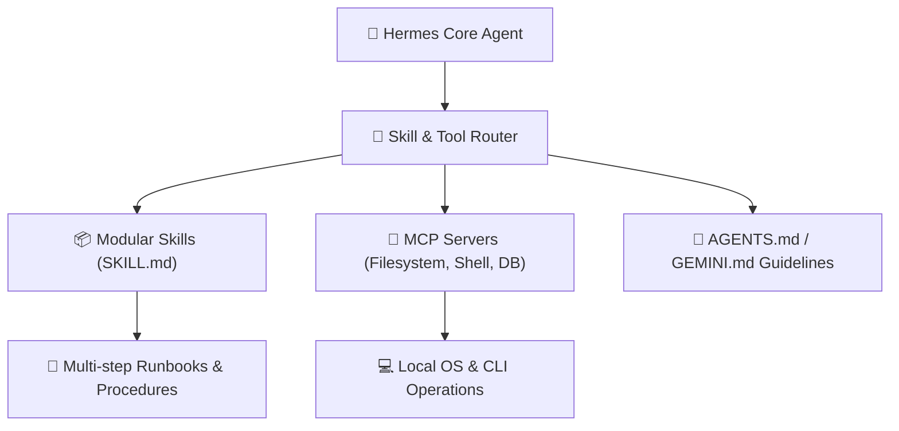

# 🦅 Hermes Agent: Autonomous Tooling & Skills

> [!NOTE]
> **Module Status**: Actively expanding. The **Hermes** ecosystem represents next-generation autonomous software engineering agents capable of running directly on terminals, Git repositories, and local tools via modular *Skills*.

---

## 🧭 Hermes Agent Architecture

---

## 🗺️ Topics & Module Roadmap

1. **What is a Skill (`SKILL.md`)?**:
   - Self-contained packages of instructions, scripts, and references teaching agents multi-step runbooks.
2. **Progressive Disclosure**:
   - Keeping context windows clean by injecting only summaries until explicitly triggered.
3. **High-Efficacy Skill Authoring**:
   - Pre-conditions, verification loops, deterministic execution steps, and exit criteria.
4. **MCP (Model Context Protocol) Tooling**:
   - Integrating filesystem, terminal, headless browser, and SQLite providers.
5. **Repository Automation**:
   - Automated PR reviews, documentation synchronization, and continuous codebase maintenance.

---

## 🔗 Second Brain Links

- Explore this repo's native skills in [[../../skills/README|Repository Skills]].
- Pair with [[en/claude/index|Claude & AI Engineering]].
- Enforce automated agent commits with [[en/github/conventional-commits|Conventional Commits]].
- Back to the central hub in [[en/index|Second Brain Docs Hub]].
