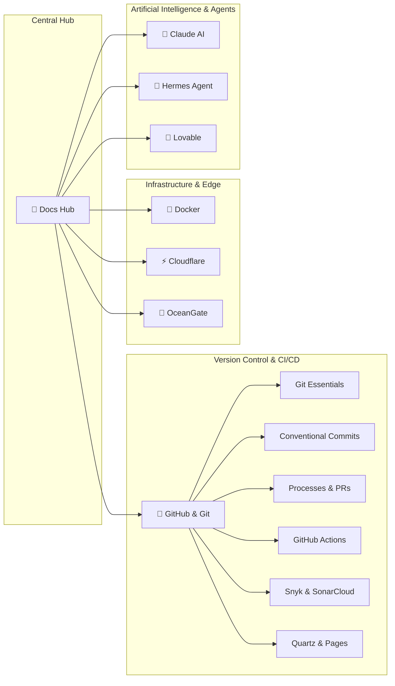

# 🧠 Central Hub of Re-explained Docs

> [!NOTE]
> **Project Vision**: Official documentation is often dry, fragmented, or purely descriptive. The goal of this **Second Brain** is to re-explain technical tools and ecosystems through practical software engineering: with conceptual architecture diagrams, production-ready commands, common pitfalls, and navigable bidirectional graph connections.

---

## 🗺️ Ecosystems & Technologies Map

Each pillar below features an in-depth module with its dedicated level on the sidebar:

### 1. 🐙 [[en/github/index|GitHub & Git Guide (Full Module)]]
The complete ecosystem for collaborative development, atomic version control, and CI/CD automation:
- [[en/github/git-essentials|Git Essentials]]: Internal architecture, object model, branches, rebase, stash, cherry-pick, and reflog.
- [[en/github/conventional-commits|Conventional Commits]]: Specification 1.0.0, type taxonomy, scopes, breaking changes, and hook validation.
- [[en/github/github-flow-processes|Processes & Governance]]: Issue lifecycle, PR anatomy, Code Review, Branch Protection, CODEOWNERS, and Milestones.
- [[en/github/github-actions-cicd|GitHub Actions & CI/CD]]: Automated workflows, triggers, runners, secrets, caching, matrix builds, and deployments.
- [[en/github/github-security-snyk-sonar|Security & Code Quality]]: Snyk (SCA/SAST), SonarCloud (Quality Gates), Dependabot, and CodeQL.
- [[en/github/github-pages-quartz|GitHub Pages & Quartz v4]]: Digital garden publishing, custom theme configurations, and static hosting.
- [[en/github/github-cli-api|GitHub CLI & REST/GraphQL API]]: Terminal productivity with the `gh` tool and script automation.

---

### 2. 🐳 [[en/docker/index|Docker & Containers (Under Construction)]]
Lightweight virtualization architecture, containerization, process isolation, multi-stage Dockerfiles, persistent volumes, bridge/overlay networks, and local orchestration with Docker Compose.

---

### 3. ⚡ [[en/cloudflare/index|Cloudflare Ecosystem (Under Construction)]]
The global edge platform: Cloudflare Workers (serverless V8 isolates), Pages, KV & R2 storage, Zero Trust, Secure Tunnels (`cloudflared`), managed DNS, and CDN optimization.

---

### 4. 🤖 [[en/claude/index|Claude & AI Engineering (Under Construction)]]
Mastering Anthropic language models: Advanced Prompt Engineering, 200k+ token context window management, Claude Code CLI, Artifact generation, and subagent orchestration.

---

### 5. 🦅 [[en/hermes/index|Hermes Agent & Skills (Under Construction)]]
Developing autonomous software agents: `SKILL.md` authoring, MCP (Model Context Protocol) tool integration, lifecycle hooks, and continuous automation.

---

### 6. 💖 [[en/lovable/index|Lovable & Full-Stack AI (Under Construction)]]
Accelerating modern AI-assisted web development: React/Vite + Tailwind CSS application architecture, native Supabase integration, and rapid prototyping patterns.

---

### 7. 🌊 [[en/oceangate/index|OceanGate / OpenGate & Edge (Under Construction)]]
Edge gateways, high-throughput reverse proxies, intelligent load balancing, and fault-tolerant distributed architectures.

---

## 🕸️ Second Brain Interactive Connection Graph

---

> [!TIP]
> **How to contribute**: Check the [[../../skills/README|Repository Skills]] to learn about workflows, writing guidelines, and local validation commands.
