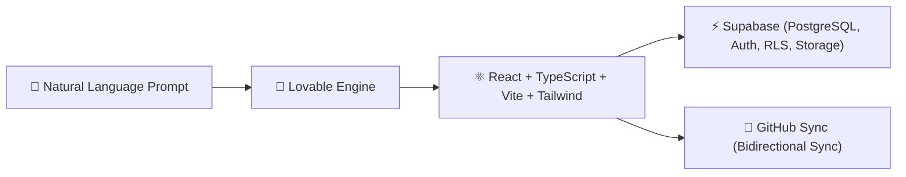

# 💖 Lovable: AI-Accelerated Full-Stack Engineering

> [!NOTE]
> **Module Status**: Actively expanding. **Lovable** accelerates web development by leveraging generative AI to build full-stack React/TypeScript web applications with instant PostgreSQL (Supabase) integration.

---

## 🧭 Lovable Architecture

---

## 🗺️ Topics & Module Roadmap

1. **Lovable Application Architecture**:
   - Clean modular layout with shadcn/ui components and Tailwind CSS.
   - State management with React Query and routing with React Router.
2. **Native Supabase Integration**:
   - User authentication (Email, Magic Links, OAuth).
   - Row Level Security (RLS) policies.
   - Database schema migrations and triggers.
3. **Bidirectional GitHub Synchronization**:
   - Continuous 2-way syncing between Lovable and your Git repository.
4. **Best Practices for AI-Generated Code**:
   - Modular prompt design and architectural specification before UI generation.

---

## 🔗 Second Brain Links

- Version control and CI/CD for Lovable in [[en/github/github-actions-cicd|GitHub Actions & CI/CD]].
- Commit standards in [[en/github/conventional-commits|Conventional Commits]].
- Back to the central hub in [[en/index|Second Brain Docs Hub]].
