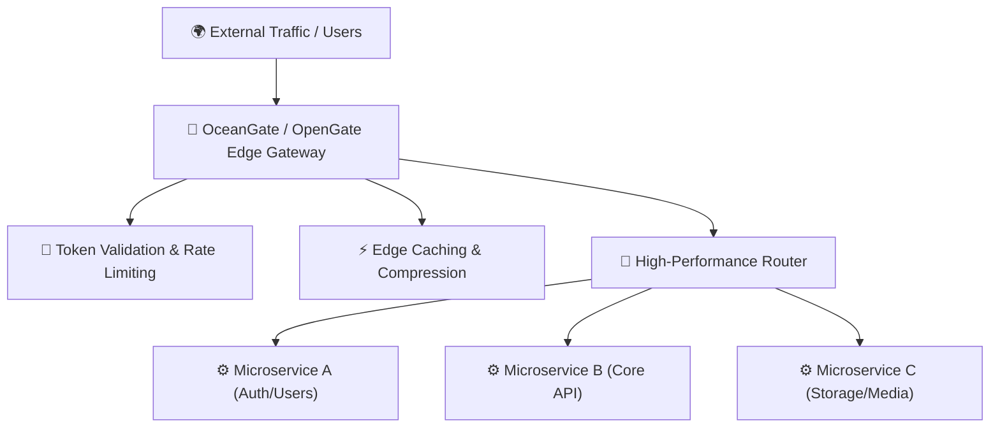

# 🌊 OceanGate / OpenGate: Edge Gateways & Architecture

> [!NOTE]
> **Module Status**: Actively expanding. The **OceanGate / OpenGate** pillar addresses modern challenges in high-throughput traffic routing, perimeter security, distributed rate limiting, intelligent load balancing, and edge observability.

---

## 🧭 Gateway & Edge Architecture

---

## 🗺️ Topics & Module Roadmap

1. **Modern API Gateway Fundamentals**:
   - Centralizing cross-cutting concerns (authentication, TLS termination, CORS, structured logging).
   - Backend for Frontend (BFF) pattern vs. unified gateway.
2. **Rate Limiting & Abuse Prevention**:
   - Token bucket, leaky bucket, and sliding window algorithms.
3. **Resilience & Fault Tolerance**:
   - Circuit breakers, exponential backoff retries, and automatic fallbacks.
4. **Cloudflare & Edge Integration**:
   - Connecting with [[en/cloudflare/index|Cloudflare Workers & Tunnels]].

---

## 📚 Official Documentation & References

- 🌊 [OceanGate API Gateway Architecture](https://octa.phrandrade.com) — Edge routing and rate limiting specifications.
- ⚡ [Redis Documentation](https://redis.io/docs/) — Distributed throttling algorithms and in-memory caching.

---

## 🔗 Second Brain Links

- Orchestrate backend microservices with [[en/docker/index|Docker & Containers]].
- Connect gateways through [[en/cloudflare/index|Cloudflare Ecosystem]].
- Back to the central hub in [[en/index|Second Brain Docs Hub]].
