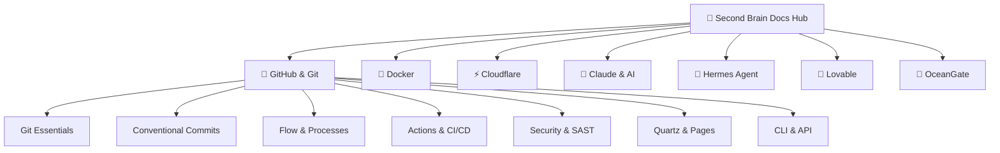

# 🧠 Segundo Cérebro: Hub de Documentações Reexplicadas
> **Welcome / Bem-vindo!** Este é um repositório e jardim digital público focado em transformar documentações técnicas fragmentadas em guias completos, reexplicados com profundidade prática, arquitetura e conexões em grafo interativo.

---

## 🌐 Selecione seu Idioma / Select Language

### 🇧🇷 [Versão em Português](./pt-br/index.md)
Explore a base de conhecimento completa em Português do Brasil:
- [[pt-br/github/index|🐙 Guia GitHub & Git]] — Commits semânticos, CI/CD, segurança e workflows ágeis.
- [[pt-br/docker/index|🐳 Docker & Containers]] — Arquitetura de containers, Compose e multi-stage.
- [[pt-br/cloudflare/index|⚡ Cloudflare]] — Workers, Pages, Zero Trust, DNS e CDN.
- [[pt-br/claude/index|🤖 Claude & IA]] — Prompt engineering, contexto e subagentes.
- [[pt-br/hermes/index|🦅 Hermes Agent]] — Agentes autônomos e criação de skills.
- [[pt-br/lovable/index|💖 Lovable]] — Desenvolvimento full-stack rápido com IA.
- [[pt-br/oceangate/index|🌊 OceanGate / OpenGate]] — Sistemas de borda e arquitetura distribuída.

👉 **[Acessar Hub em Português](./pt-br/index.md)**

### 🇺🇸 [English Version](./en/index.md)
Explore the full re-explained knowledge base in English:
- [[en/github/index|🐙 GitHub & Git Guide]] — Conventional commits, CI/CD, security and agile workflows.
- [[en/docker/index|🐳 Docker & Containers]] — Container architecture, Compose and multi-stage.
- [[en/cloudflare/index|⚡ Cloudflare]] — Workers, Pages, Zero Trust, DNS and CDN.
- [[en/claude/index|🤖 Claude & AI]] — Prompt engineering, context windows and subagents.
- [[en/hermes/index|🦅 Hermes Agent]] — Autonomous agents and skill authoring.
- [[en/lovable/index|💖 Lovable]] — AI-assisted full-stack development.
- [[en/oceangate/index|🌊 OceanGate / OpenGate]] — Edge systems and distributed architecture.

👉 **[Access English Hub](./en/index.md)**

---

## 🧭 Pilares do Conhecimento / Knowledge Pillars

---

> [!TIP]
> Use o seletor de idiomas no menu superior (🇧🇷 PT-BR / 🇺🇸 EN-US) ou clique em qualquer nó do grafo na barra lateral direita para navegar pelas conexões conceituais!
