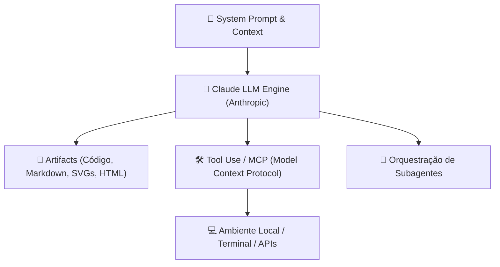

# 🤖 Claude & Engenharia de IA: Da Teoria aos Agentes

> [!NOTE]
> **Status do Módulo**: Em expansão contínua. Os modelos da família Claude (Claude 3.5 Sonnet, Claude 3 Opus, Claude 3.7) redefiniram o estado da arte em raciocínio, geração de código, obediência estrita a instruções e janelas de contexto estendidas (200k+ tokens).

---

## 🧭 Arquitetura de Interação com Claude

---

## 🗺️ Tópicos & Roadmap do Módulo

1. **Fundamentos do Claude & Família de Modelos**:
   - Comparativo de modelos: Sonnet (equilíbrio ideal para código), Opus (raciocínio complexo) e Haiku (velocidade e custo ultrabaixo).
   - O paradigma de *Constitutional AI* e alinhamento de segurança.
2. **Prompt Engineering Avançado para Código**:
   - Uso de tags XML (`<context>`, `<instructions>`, `<guidelines>`) para estruturação rígida de contexto.
   - Técnicas de *Chain-of-Thought* (raciocínio passo a passo) e *Few-Shot Prompting*.
   - Minimização de alucinações e imposição de padrões de codificação.
3. **Gestão Eficiente de Janela de Contexto**:
   - Estratégias para trabalhar com bases de código volumosas sem estourar o limite de tokens.
   - *Prompt Caching*: Redução de até 90% do custo e 85% da latência para contextos estáticos repetidos.
4. **Claude Code CLI & Pair Programming Autônomo**:
   - Utilização da ferramenta de linha de comando da Anthropic para refatorações profundas, criação de testes e navegação em repositórios.
5. **Tool Use & Protocolo MCP (Model Context Protocol)**:
   - Como conectar o Claude a servidores externos de dados, bancos SQL, ferramentas de terminal e navegadores.

---

## 🔗 Conexões do Segundo Cérebro

- Desenvolva agentes autônomos baseados em habilidades com [[pt-br/hermes/index|Hermes Agent & Skills]].
- Integre o Claude no fluxo de desenvolvimento com [[pt-br/github/github-flow-processes|Processos de Code Review no GitHub]].
- Retorne ao [[pt-br/index|Hub Central de Documentações]].
