# ⚡ Cloudflare Ecosystem: Borda, Serverless & Segurança

> [!NOTE]
> **Status do Módulo**: Em expansão contínua. A Cloudflare evoluiu de uma rede de entrega de conteúdo (CDN) e proteção contra DDoS para a mais rápida plataforma global de computação em borda (Edge Computing) do mundo.

---

## 🧭 Arquitetura de Borda Cloudflare

```mermaid
graph TD
    User["🌍 Usuário Global"] --> Edge["⚡ Cloudflare Anycast Network (330+ Cidades)"]
    Edge --> Workers["⚙️ Cloudflare Workers (V8 Isolates, 0ms Cold Start)"]
    Edge --> Pages["📄 Cloudflare Pages (Frontend Hosting)"]
    Edge --> Storage["💾 Edge Storage (KV, R2, D1, Hyperdrive)"]
    Edge --> Tunnel["🚇 Cloudflared Tunnel (Conexão Segura com Servidor Local)"]
    Tunnel --> LocalApp["🖥️ Aplicação On-Premise / Servidor Privado"]
```

---

## 🗺️ Tópicos & Roadmap do Módulo

1. **Cloudflare Workers**:
   - Arquitetura baseada em V8 Isolates vs. Lambdas tradicionais baseados em containers.
   - Vantagens de inicialização com *zero cold start* e latência sub-milissegundo.
   - Gerenciamento com Wrangler CLI.
2. **Cloudflare Pages**:
   - Deploy contínuo de aplicações front-end (React, Vite, Next.js estático, Astro).
   - Integração com repositórios GitHub e preview branches automáticas.
3. **Armazenamento Distribuído na Borda**:
   - **Workers KV**: Banco chave-valor global de baixa latência e leitura ultra-rápida.
   - **Cloudflare R2**: Armazenamento de objetos compatível com API S3 sem taxa de saída de dados (*zero egress fees*).
   - **Cloudflare D1**: Banco de dados relacional SQLite distribuído na borda.
4. **Cloudflare Tunnels (`cloudflared`)**:
   - Exposição segura de serviços locais e portas internas para a web pública sem abrir portas no roteador ou configurar IP público estático.
5. **Zero Trust & Access**:
   - Políticas de controle de acesso corporativo, autenticação com provedores OAuth2 e túneis VPN sem cliente.

---

## 🔗 Conexões do Segundo Cérebro

- Configure o deploy contínuo de documentações em [[pt-br/github/github-pages-quartz|GitHub Pages & Quartz v4]].
- Automatize publicações no Cloudflare via [[pt-br/github/github-actions-cicd|GitHub Actions & CI/CD]].
- Retorne ao [[pt-br/index|Hub Central de Documentações]].
