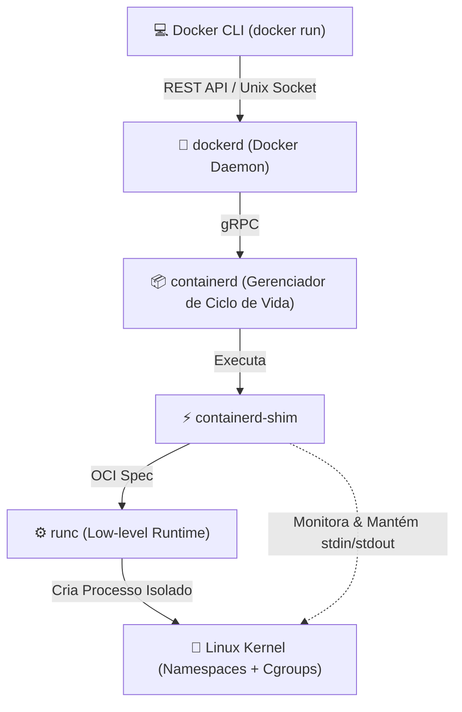
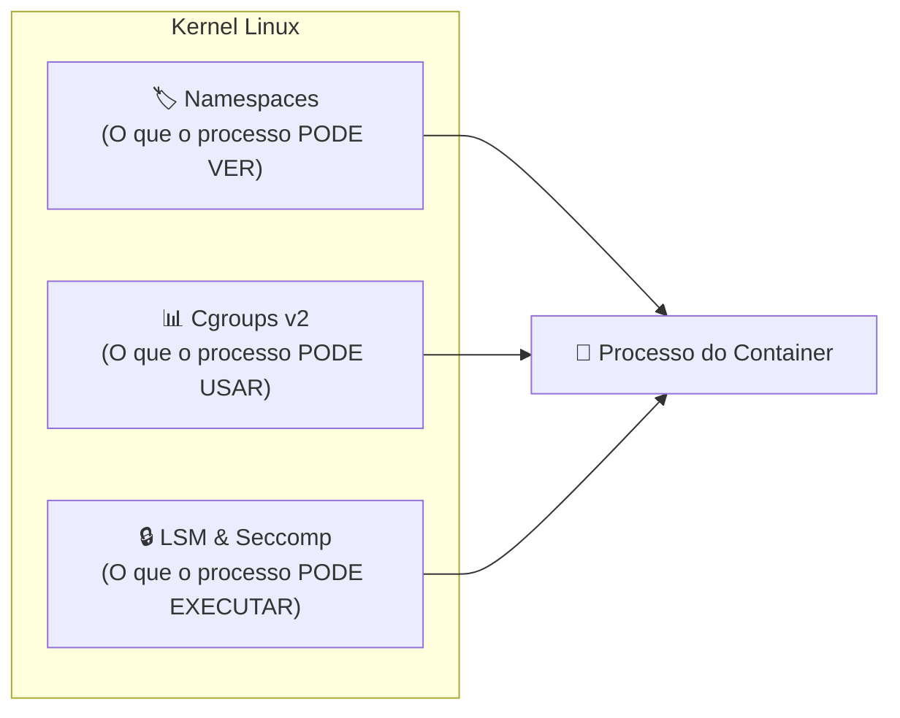
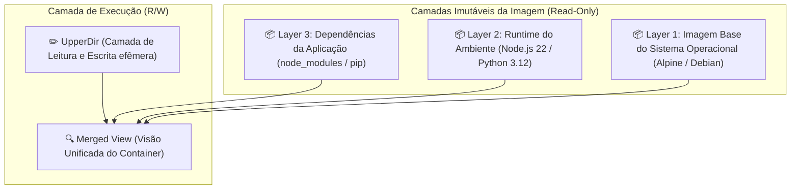

# ⚙️ Mecânica Interna & Arquitetura do Docker Engine

> [!NOTE]
> Um container **não é uma máquina virtual**. Containers são simplesmente **processos comuns do Linux** isolados através de recursos nativos do kernel: *Namespaces* (visão do sistema), *Control Groups* (limites de recursos) e *OverlayFS* (camadas de arquivos).

---

## 🏗️ 1. A Pilha de Execução do Docker

O Docker moderno adota a especificação aberta **OCI (Open Container Initiative)** e divide sua arquitetura em camadas desacopladas:



### Componentes da Arquitetura:
1. **Docker Daemon (`dockerd`)**: Fornece a API de alto nível, gerencia imagens, volumes, redes e autenticação com registries.
2. **`containerd`**: Daemon independente que cuida da transferência de imagens, execução de containers e supervisão de processos.
3. **`containerd-shim`**: Processo leve que permanece vivo ao lado do container para manter os descritores de arquivos abertos (stdin, stdout, stderr) mesmo se o daemon principal for reiniciado.
4. **`runc`**: A implementação de referência da OCI que conversa diretamente com as chamadas de sistema do kernel (*syscalls* como `clone`, `unshare`, `pivot_root`).

---

## 🛡️ 2. Os Pilares do Isolamento no Linux



### 2.1. Linux Namespaces (Isolamento de Visão)
| Namespace | O que isola | Efeito Prático no Container |
| :--- | :--- | :--- |
| **`pid`** | Árvore de Processos | O processo principal do container enxerga a si mesmo como `PID 1`. |
| **`net`** | Interfaces de Rede & Portas | Cada container possui seu próprio loopback, IP virtual e tabela de rotas. |
| **`mnt`** | Pontos de Montagem | O container enxerga sua própria raiz de arquivos (`/`), isolada do host. |
| **`ipc`** | Memória Compartilhada | Bloqueia comunicação IPC (semáforos, queues) com outros containers. |
| **`uts`** | Hostname & Domínio | Permite que o container defina seu próprio hostname. |
| **`user`** | UID / GID Mappings | Permite que o `root` dentro do container mapeie para um usuário sem privilégios no host. |

### 2.2. Control Groups (Cgroups v2)
Enquanto os namespaces isolam a visão, os **Cgroups** limitam o consumo físico de recursos da máquina hospedeira:
- **CPU**: Quotas de tempo de CPU (`cpu.max`) e afinidade de núcleos.
- **Memória**: Limite rígido (`memory.max`), limite suave (`memory.high`) e proteção contra OOM (*Out Of Memory Killer*).
- **I/O de Disco**: Limitação de IOPS e largura de banda de leitura/escrita em discos NVMe/SSD.

---

## 🗂️ 3. Sistema de Arquivos em Camadas: Overlay2

O Docker utiliza o driver de armazenamento **OverlayFS (overlay2)** para compor o sistema de arquivos final do container sem duplicar dados em disco:



### Mecânica de Copy-on-Write (CoW):
- Quando um container lê um arquivo existente na imagem, a leitura é feita diretamente das camadas imutáveis (*LowerDir*).
- Quando o container modifica ou remove um arquivo da imagem, o kernel copia esse arquivo para a camada efêmera (*UpperDir*) antes de alterá-lo. O arquivo original na imagem permanece 100% intacto.

---

## 🔬 4. Inspecionando Containers no Terminal

Comandos avançados para inspecionar os recursos reais no Linux:

```bash
# Executar um container interativo com limite de 512MB e 1 CPU
docker run -d --name app-isolada --memory=512m --cpus=1.0 alpine sleep 3600

# Obter o PID real do container no Host
CONTAINER_PID=$(docker inspect --format '{{.State.Pid}}' app-isolada)
echo "PID no host: $CONTAINER_PID"

# Inspecionar os Namespaces ativos no processo
ls -l /proc/$CONTAINER_PID/ns/

# Inspecionar os limites de Cgroups v2 no Kernel Linux
cat /sys/fs/cgroup/system.slice/docker-*.scope/memory.max 2>/dev/null || cat /sys/fs/cgroup/memory/docker/$CONTAINER_PID/memory.limit_in_bytes 2>/dev/null
```

---

## 🔗 Conexões do Segundo Cérebro

- [[pt-br/docker/dockerfile-multistage-best-practices|Práticas Avançadas de Dockerfile Multi-Stage]]
- [[pt-br/docker/docker-compose-production|Orquestração de Produção com Docker Compose]]
- [[pt-br/github/github-security-snyk-sonar|Auditoria de Vulnerabilidades em Containers]]
