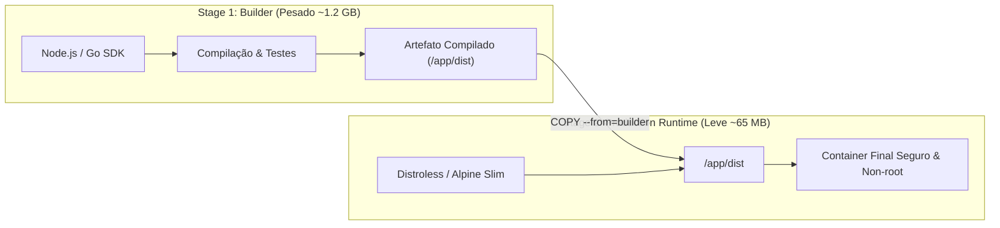

# 📦 Padrões de Dockerfile Multi-Stage para Produção

> [!TIP]
> Imagens de produção devem conter **apenas o executável da aplicação e suas dependências de runtime**. Ferramentas de compilação (compiladores C++, TypeScript CLI, SDKs de desenvolvimento) devem ser descartadas através de **Multi-Stage Builds**, reduzindo o tamanho de gigabytes para megabytes.

---

## 🏗️ 1. Como Funciona o Multi-Stage Build



---

## 💻 2. Dockerfile de Produção para Node.js (TypeScript / Next.js)

```dockerfile
# syntax=docker/dockerfile:1.4
# ==========================================
# STAGE 1: Instalação de Dependências
# ==========================================
FROM node:22-alpine AS deps
RUN apk add --no-cache libc6-compat
WORKDIR /app

# Copia apenas manifestos para maximizar cache de camadas
COPY package.json package-lock.json ./
RUN npm ci --frozen-lockfile

# ==========================================
# STAGE 2: Build & Compilação
# ==========================================
FROM node:22-alpine AS builder
WORKDIR /app
COPY --from=deps /app/node_modules ./node_modules
COPY . .

# Desativa telemetria e executa build
ENV NODE_ENV=production
RUN npm run build && npm prune --production

# ==========================================
# STAGE 3: Runtime Final de Produção
# ==========================================
FROM node:22-alpine AS runner
WORKDIR /app

ENV NODE_ENV=production
ENV PORT=3000

# Criação de usuário sem privilégios (Non-root)
RUN addgroup --system --gid 1001 nodejs && \
    adduser --system --uid 1001 nodejsuser

# Copia apenas o necessário do estágio de build
COPY --from=builder /app/package.json ./package.json
COPY --from=builder --chown=nodejsuser:nodejs /app/node_modules ./node_modules
COPY --from=builder --chown=nodejsuser:nodejs /app/dist ./dist

# Define usuário seguro
USER nodejsuser

EXPOSE 3000

# Healthcheck nativo
HEALTHCHECK --interval=30s --timeout=3s --start-period=5s --retries=3 \
  CMD wget --no-verbose --tries=1 --spider http://localhost:3000/health || exit 1

CMD ["node", "dist/index.js"]
```

---

## 🎯 3. As 6 Regras de Ouro para Imagens de Produção

### 1. Ordem das Camadas de Cache
Coloque instruções que mudam com pouca frequência (`COPY package*.json`, `RUN npm ci`) **antes** de instruções que mudam com frequência (`COPY . .`).

### 2. Sempre Adicione um `.dockerignore` Rigoroso
Evite enviar lixo local, segredos ou arquivos temporários para o contexto do Docker daemon:

```text
# .dockerignore
node_modules
.git
.github
*.log
.env*
dist
build
coverage
.DS_Store
```

### 3. Nunca Execute como `root`
Por padrão, containers rodam com UID `0` (`root`). Se houver uma falha de segurança que escape do container, o invasor terá privilégios de root no host. Sempre adicione `USER appuser`.

### 4. Utilize Imagens Base Mínimas e Confiáveis
- Prefira imagens oficiais com sufixos `-alpine`, `-slim` ou **Google Distroless** (`gcr.io/distroless/nodejs22-debian12`).

### 5. Ative o Docker BuildKit
O BuildKit permite compilação paralela de estágios independentes e montagem de caches persistentes:
```bash
# Executar build com BuildKit e cache de montagem
DOCKER_BUILDKIT=1 docker build -t minha-app:prod .
```

---

## 📚 Documentação Original & Fontes de Referência

- 🌐 [Docker Engine Official Documentation](https://docs.docker.com/engine/) — Arquitetura oficial, CLI e storage drivers.
- 📦 [Open Container Initiative (OCI) Runtime Spec](https://github.com/opencontainers/runtime-spec) — Especificação técnica do runc e containerd.
- 🐙 [Docker Compose Specification](https://docs.docker.com/compose/compose-file/) — Especificação oficial do compose.yaml.
- 🐧 [Kernel Linux: Cgroups v2 & Namespaces](https://www.kernel.org/doc/Documentation/cgroup-v2.txt) — Documentação oficial do kernel.

---

## 🔗 Conexões do Segundo Cérebro

- [[pt-br/docker/docker-architecture-engine|Mecânica Interna & Arquitetura do Docker Engine]]
- [[pt-br/docker/docker-compose-production|Orquestração de Produção com Docker Compose]]
- [[pt-br/github/github-security-snyk-sonar|Segurança de Imagens & Análise de Vulnerabilidades]]
