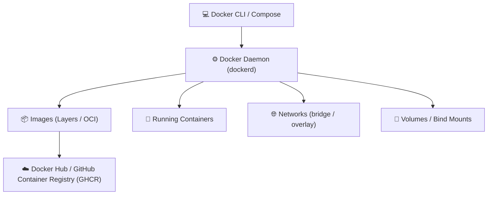

# 🐳 Docker & Containers: Arquitetura & Guia Prático

> [!NOTE]
> **Status do Módulo**: Em expansão contínua. Este pilar aborda a transição de aplicações monolíticas para arquiteturas encapsuladas em containers OCI (*Open Container Initiative*), otimização de imagens de produção e orquestração local.

---

## 🧭 Visão Geral do Ecossistema Docker

---

## 🗺️ Tópicos & Roadmap do Módulo

1. **Fundamentos do Docker**:
   - Isolamento de processos via Linux *Namespaces*, *cgroups* e *UnionFS*.
   - Diferenças essenciais entre Máquinas Virtuais (Hipervisor) e Containers.
2. **Construção Otimizada de Imagens (Dockerfile)**:
   - Estratégias de *Multi-stage Build* para reduzir o tamanho de imagem de ~1GB para <50MB.
   - Ordem de instruções para maximizar o cache de camadas do Docker.
   - Práticas de segurança: execução como usuário não-root (`USER appuser`).
3. **Orquestração Local com Docker Compose**:
   - Gerenciamento declarativo de múltiplos serviços, bancos de dados e caches.
   - Variáveis de ambiente (`.env`), healthchecks e dependências de inicialização (`depends_on`).
4. **Volumes & Persistência de Dados**:
   - Bind mounts vs. Named Volumes vs. tmpfs.
5. **Redes no Docker**:
   - Modos de rede: `bridge`, `host`, `overlay` e isolamento de tráfego entre serviços.
6. **Integração com CI/CD**:
   - Publicação automatizada de imagens no GitHub Packages / GHCR via [[pt-br/github/github-actions-cicd|GitHub Actions]].

---

## 🔗 Conexões do Segundo Cérebro

- Integre a compilação e teste de containers no seu fluxo com [[pt-br/github/github-actions-cicd|GitHub Actions & CI/CD]].
- Faça varreduras de vulnerabilidades em imagens Docker com [[pt-br/github/github-security-snyk-sonar|Snyk & Segurança]].
- Retorne ao [[pt-br/index|Hub Central de Documentações]].
