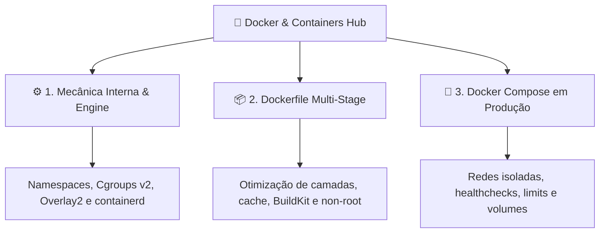

# 🐳 Docker & Containers Hub

> [!NOTE]
> Bem-vindo ao **Hub de Docker & Containers**. Este módulo reúne documentações técnicas reexplicadas com profundidade de engenharia, desmistificando desde o isolamento de baixo nível no kernel do Linux até a arquitetura de stacks completas em produção.

---

## 🗺️ Mapa de Navegação do Módulo

---

## 📚 Guias Disponíveis

1. [[pt-br/docker/docker-architecture-engine|⚙️ Mecânica Interna & Arquitetura do Docker Engine]]
   - A pilha OCI: `dockerd`, `containerd`, `containerd-shim` e `runc`.
   - Isolamento no Linux: Namespaces (`pid`, `net`, `mnt`, `ipc`, `user`) e Cgroups v2.
   - Sistema de arquivos em camadas com driver `overlay2` e Copy-on-Write.

2. [[pt-br/docker/dockerfile-multistage-best-practices|📦 Padrões de Dockerfile Multi-Stage para Produção]]
   - Separação de estágios de build e runtime com imagens Distroless e Alpine.
   - Maximização do cache de camadas e arquivos `.dockerignore`.
   - Execução com usuários sem privilégios (*non-root*).

3. [[pt-br/docker/docker-compose-production|🐙 Orquestração de Produção com Docker Compose]]
   - Topologia de rede dividida em redes públicas (*frontend-net*) e privadas (*backend-net*).
   - Definição de `healthcheck` robusto e condições `depends_on`.
   - Limites rígidos de consumo de CPU e Memória RAM.

---

## 🔗 Conexões do Segundo Cérebro

- [[pt-br/github/github-actions-cicd|CI/CD no GitHub Actions: Build & Push de Imagens]]
- [[pt-br/github/github-security-snyk-sonar|Segurança de Containers: Snyk & SonarCloud]]
- [[pt-br/cloudflare/index|Cloudflare Hub: Edge Containers & Tunnels]]
