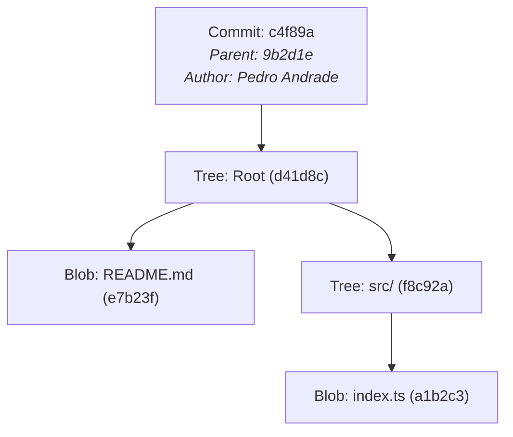
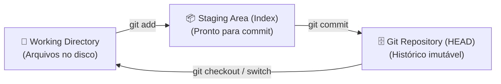
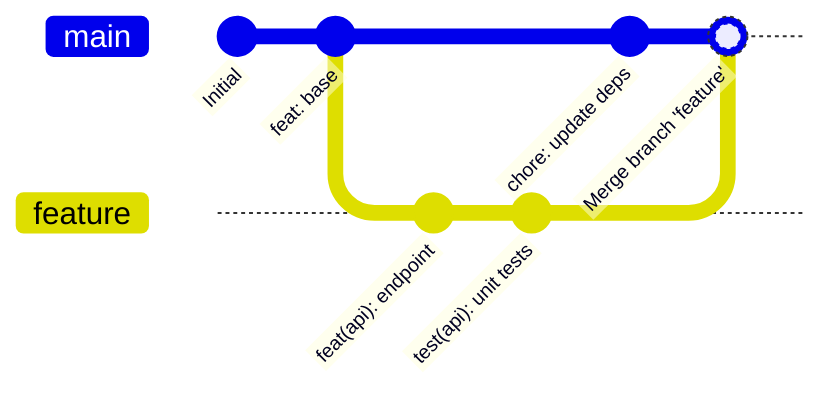

# ⚙️ Fundamentos & Mecânica Interna do Git

> [!NOTE]
> O Git não é apenas um utilitário de sincronização; é um **banco de dados de objetos indexados por conteúdo (Content-Addressable Database)** com um sistema de arquivos versionado por cima. Compreender seu funcionamento interno elimina o medo de comandos avançados como `rebase`, `reset` e `reflog`.

---

## 🏗️ 1. Arquitetura Interna do Git

O Git armazena todo o histórico em um diretório oculto `.git/`. Internamente, existem quatro tipos primários de objetos, identificados por um hash SHA-1 (ou SHA-256):

1. **Blob**: Armazena o conteúdo puro dos arquivos (sem metadados de nome ou permissões).
2. **Tree**: Representa um diretório. Mapeia nomes de arquivos para hashes de Blobs ou outras Trees aninhadas.
3. **Commit**: Contém o ponteiro para uma Tree raiz, metadados (autor, comitente, timestamp, mensagem) e o hash do commit pai (parent).
4. **Annotated Tag**: Um ponteiro fixo para um commit com mensagem e assinatura criptográfica.



---

## 🗂️ 2. As Três Áreas de Trabalho

O fluxo de dados no Git transita entre três estados fundamentais:



- **Working Directory**: Seus arquivos reais no sistema operacional onde ocorrem as edições.
- **Staging Area (Index)**: Uma foto intermediária das alterações selecionadas que farão parte do próximo snapshot.
- **Repository (HEAD)**: O histórico imutável com a árvore de commits gravada.

---

## 🌿 3. Estratégias de Branch: Merge vs. Rebase

Ao integrar alterações de uma branch de funcionalidade (`feature`) com a branch principal (`main`), existem duas filosofias principais:



### Quando usar Merge:
- Preserva o histórico não-linear e a cronologia exata de quando as branches foram criadas e fundidas.
- Seguro para branches públicas compartilhadas por múltiplos desenvolvedores.
- Comando:
  ```bash
  git checkout main
  git merge feature/nova-funcionalidade --no-ff
  ```

### Quando usar Rebase:
- Reescreve o ponto de partida da sua branch para o topo da `main`, gerando um histórico estritamente linear e limpo.
- Ideal para limpar commits locais antes de submeter um Pull Request.
- Comando:
  ```bash
  git checkout feature/nova-funcionalidade
  git rebase main
  ```

> [!WARNING]
> **A Regra de Ouro do Rebase**: NUNCA faça rebase em branches públicas ou compartilhadas (como `main` ou `develop`). Faça rebase apenas nas suas branches locais de trabalho.

---

## 🛠️ 4. Guia Rápido de Comandos Essenciais & Avançados

### 4.1. Stash: Salvamento Temporário
Guarda modificações não commitadas para que você possa trocar de contexto rapidamente:

```bash
# Salvar modificações com uma mensagem descritiva (incluindo arquivos não rastreados)
git stash push -u -m "WIP: ajuste de rota de login"

# Listar os stashes salvos
git stash list

# Aplicar o stash mais recente e removê-lo da pilha
git stash pop

# Aplicar um stash específico sem removê-lo
git stash apply stash@{1}
```

---

### 4.2. Cherry-Pick: Portabilidade Atômica de Commits
Aplica as mudanças de um commit específico de outra branch na branch atual:

```bash
# Aplicar um único commit
git cherry-pick <commit-sha>

# Aplicar múltiplos commits em sequência (sem incluir o primeiro)
git cherry-pick <sha-inicio>..<sha-fim>

# Aplicar o commit sem comitar imediatamente (vai para a Staging Area)
git cherry-pick -n <commit-sha>
```

---

### 4.3. Reset vs. Revert: Desfazendo Alterações

| Ação | `git reset` | `git revert` |
| :--- | :--- | :--- |
| **Mecanismo** | Move o ponteiro da branch para trás (reescreve histórico). | Cria um novo commit que aplica a diferença inversa. |
| **Segurança** | Seguro apenas em branches locais privadas. | 100% seguro para branches públicas e produção. |
| **Uso Típico** | Desfazer commits locais que ainda não foram enviados com push. | Desfazer uma release com bug em produção. |

```bash
# Reset suave (mantém alterações na Staging Area)
git reset --soft HEAD~1

# Reset padrão (mantém alterações no Working Directory, remove do Index)
git reset HEAD~1

# Reset destrutivo (descarta todas as alterações nos arquivos)
git reset --hard HEAD~1

# Revert seguro (cria novo commit de reversão)
git revert <commit-sha>
```

---

### 4.4. Reflog: A Rede de Segurança Suprema
O Git mantém um diário de bordo local (`reflog`) de todas as vezes que o ponteiro `HEAD` mudou de posição (commits, resets, rebases, checkouts). Mesmo se você fizer um `git reset --hard` acidental, seus commits continuam no disco por até 30 dias.

```bash
# Ver histórico de movimentações do HEAD
git reflog

# Saída típica:
# 9a2b3c1 HEAD@{0}: reset: moving to HEAD~2
# 8f1e2d3 HEAD@{1}: commit: feat(auth): add jwt middleware
# 7c4b5a6 HEAD@{2}: commit: fix(api): validation bug

# Recuperar o estado anterior ao reset:
git reset --hard HEAD@{1} # ou git reset --hard 8f1e2d3
```

---

### 4.5. Bisect: Localização Binária de Bugs
Encontra o commit exato que introduziu uma regressão através de busca binária:

```bash
git bisect start
git bisect bad                 # O commit atual tem o bug
git bisect good v1.0.0         # A tag v1.0.0 funcionava perfeitamente

# O Git faz checkout do commit intermediário automaticamente.
# Teste a aplicação e informe:
git bisect good # ou git bisect bad

# Ao terminar:
git bisect reset
```

---

## 🔗 Próximos Passos & Conexões

Agora que você domina a mecânica interna do Git:
- Padronize suas mensagens com [[pt-br/github/conventional-commits|Conventional Commits]].
- Estruture o ciclo de vida de colaboração com [[pt-br/github/github-flow-processes|Processos de Issues, PRs & Governança]].
- Automatize a validação das suas branches com [[pt-br/github/github-actions-cicd|GitHub Actions CI/CD]].
