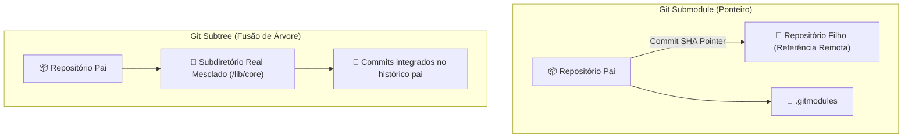

# 🌳 Git Submodules vs Git Subtrees: Repositórios Aninhados

> [!NOTE]
> Quando um projeto precisa reutilizar código de outro repositório Git (uma biblioteca compartilhada, um template de infraestrutura ou submódulos de documentação), existem duas abordagens arquiteturais principais no Git: **Submodules** (apontamento por ponteiro SHA) e **Subtrees** (cópia real embutida no histórico).

---

## 🏗️ 1. Comparativo Arquitetural: Submodule vs Subtree



| Critério | Git Submodule | Git Subtree |
| :--- | :--- | :--- |
| **Armazenamento** | Apenas armazena um ponteiro (SHA-1) e URL no `.gitmodules`. | Copia os arquivos e histórico diretamente no repositório pai. |
| **Clonagem por Terceiros** | Requer `git submodule update --init --recursive`. | Transparente: `git clone` já baixa tudo normalmente. |
| **Complexidade** | Alta (estado de *detached HEAD*, commits esquecidos). | Baixa para quem consome, média para quem sincroniza. |
| **Ideal Para** | Dependências estritamente desacopladas e versionadas por tag. | Frameworks compartilhados onde colaboradores editam no pai. |

---

## 💻 2. Guia Prático de Git Submodules

### Adicionando um Submódulo:
```bash
# Adiciona o repositório como submódulo na pasta 'plugins/meu-plugin'
git submodule add https://github.com/usuario/meu-plugin.git plugins/meu-plugin

# Visualiza o arquivo .gitmodules gerado
cat .gitmodules
```

### Clonando Projetos com Submódulos:
```bash
# Clone recursivo (baixa o repositório pai e todos os filhos automaticamente)
git clone --recurse-submodules https://github.com/usuario/devops-guide.git

# Ou se já clonou sem a flag:
git submodule update --init --recursive
```

### Atualizando Submódulos para o Commit Mais Recente:
```bash
# Atualiza todos os submódulos para a branch remota correspondente
git submodule update --remote --merge
```

---

## 🌲 3. Guia Prático de Git Subtrees

O Git Subtree é nativo do Git e não cria arquivos de metadados como `.gitmodules`:

### Adicionando uma Subtree:
```bash
# Adiciona o repositório remoto como um prefixo local (/libs/auth)
git subtree add --prefix=libs/auth https://github.com/usuario/auth-lib.git main --squash
```

### Puxando Atualizações da Subtree:
```bash
git subtree pull --prefix=libs/auth https://github.com/usuario/auth-lib.git main --squash
```

### Enviando Modificações Locais de Volta ao Repositório Original:
```bash
git subtree push --prefix=libs/auth https://github.com/usuario/auth-lib.git main
```

---

## ⚠️ 4. Armadilhas Comuns & Boas Práticas

1. **Submodule Detached HEAD**: Submódulos apontam para SHAs específicos, não branches. Ao editar código dentro de um submódulo, faça `git checkout main` antes de commitar.
2. **GitHub Actions CI/CD**: Para clonar submódulos em pipelines, configure `submodules: recursive` no `actions/checkout@v4`:
```yaml
- uses: actions/checkout@v4
  with:
    submodules: recursive
    token: ${{ secrets.PAT_GITHUB }} # Se os submódulos forem privados
```

---

## 📚 Documentação Original & Fontes de Referência

- 🌐 [Git SCM Official Documentation](https://git-scm.com/doc) — Documentação e livro Pro Git oficial.
- 🐙 [GitHub Docs](https://docs.github.com/) — Guias oficiais do GitHub sobre Actions, PRs, Security e API.
- 📦 [Conventional Commits 1.0.0 Specification](https://www.conventionalcommits.org/pt-br/v1.0.0/) — Especificação oficial em português.
- 🛡️ [SonarCloud Documentation](https://docs.sonarcloud.io/) & [Snyk Docs](https://docs.snyk.io/) — Guias oficiais de SAST e segurança.

---

## 🔗 Conexões do Segundo Cérebro

- [[pt-br/github/git-essentials|Fundamentos do Git & Mecânica Interna]]
- [[pt-br/github/github-flow-processes|Governança & Fluxos de Pull Request]]
- [[pt-br/github/github-actions-cicd|CI/CD no GitHub Actions & Caching]]
