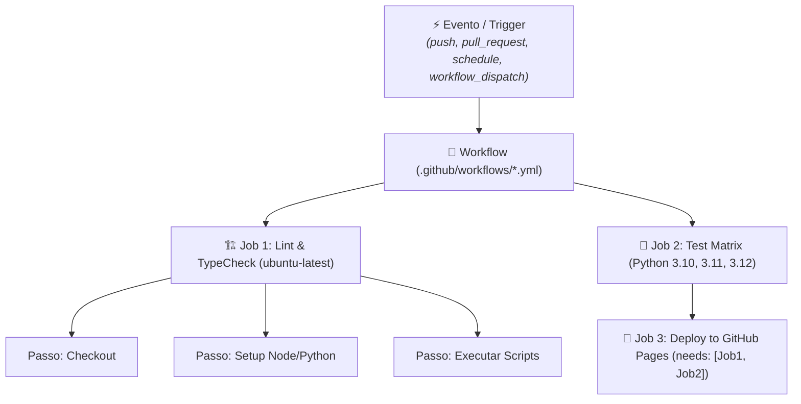

# 🚀 GitHub Actions & CI/CD Automatizado

> [!NOTE]
> O **GitHub Actions** transforma seu repositório em uma central de automação com capacidade de compilar, testar, empacotar, analisar segurança e publicar software diretamente em resposta a qualquer evento do ciclo de vida do Git.

---

## 🏛️ 1. Anatomia Arquitetural do GitHub Actions

Um pipeline do GitHub Actions é estruturado hierarquicamente:



### Componentes Principais:
1. **Workflows**: Arquivos YAML declarativos armazenados em `.github/workflows/`.
2. **Events (Triggers)**: Gatilhos que iniciam o workflow (`push`, `pull_request`, `workflow_dispatch`, `release`, `schedule`).
3. **Jobs**: Conjunto de passos executados no mesmo runner. Por padrão, jobs rodam em paralelo, a menos que usem a diretiva `needs: [job_anterior]`.
4. **Runners**: Servidores virtuais (hospedados pelo GitHub ou self-hosted) que executam os jobs (`ubuntu-latest`, `windows-latest`, `macos-latest`).
5. **Steps & Actions**: Comandos de shell (`run: ...`) ou unidades reutilizáveis empacotadas pela comunidade (`uses: actions/checkout@v4`).

---

## ⚡ 2. Gatilhos (Triggers) Mais Comuns

```yaml
on:
  # Dispara em push para a branch main
  push:
    branches:
      - main
    paths-ignore:
      - '**.md' # Ignora mudanças puramente em documentação se desejado

  # Dispara na abertura e atualização de Pull Requests contra a main
  pull_request:
    branches:
      - main

  # Permite disparo manual via botão na interface do GitHub ou via CLI (gh workflow run)
  workflow_dispatch:
    inputs:
      ambiente:
        description: 'Ambiente de destino'
        required: true
        default: 'staging'
        type: choice
        options:
          - staging
          - production

  # Agendamento cron (ex.: todo dia à meia-noite UTC)
  schedule:
    - cron: '0 0 * * *'
```

---

## 🧩 3. Matrizes de Execução (Matrix Builds)

Teste simultaneamente em múltiplas versões de linguagem e sistemas operacionais com uma única declaração de job:

```yaml
jobs:
  test:
    runs-on: ${{ matrix.os }}
    strategy:
      fail-fast: false # Não cancela os outros jobs se um falhar
      matrix:
        os: [ubuntu-latest, macos-latest]
        node-version: [18, 20, 22]
    steps:
      - uses: actions/checkout@v4
      - name: Configurar Node.js ${{ matrix.node-version }}
        uses: actions/setup-node@v4
        with:
          node-version: ${{ matrix.node-version }}
          cache: 'npm'
      - run: npm ci
      - run: npm test
```

---

## ⚡ 4. Otimização & Caching de Dependências

O uso de cache reduz drasticamente o tempo de execução dos pipelines e economiza minutos de execução do runner:

```yaml
- name: Cache de Módulos Node
  uses: actions/cache@v4
  with:
    path: ~/.npm
    key: ${{ runner.os }}-node-${{ hashFiles('**/package-lock.json') }}
    restore-keys: |
      ${{ runner.os }}-node-
```

> [!TIP]
> A maioria das actions de setup oficiais (como `actions/setup-node@v4` e `actions/setup-python@v5`) já incluem suporte nativo à flag `cache: 'npm'` ou `cache: 'pip'`, tornando a declaração manual do `actions/cache` dispensável na maioria dos casos.

---

## 🌐 5. Pipeline Real: Deploy Contínuo do Quartz no GitHub Pages

Este repositório utiliza o seguinte workflow de produção em `.github/workflows/deploy-gh-pages.yaml`:

```yaml
name: Deploy to GitHub Pages

on:
  push:
    branches:
      - main
  workflow_dispatch:

permissions:
  contents: read
  pages: write
  id-token: write

concurrency:
  group: "pages"
  cancel-in-progress: true

jobs:
  build:
    runs-on: ubuntu-latest
    steps:
      - name: Checkout Repositório
        uses: actions/checkout@v4
        with:
          fetch-depth: 0 # Garante histórico completo para datas de criação/modificação

      - name: Configurar Node.js 22
        uses: actions/setup-node@v4
        with:
          node-version: 22

      - name: Instalar Dependências
        run: npm ci

      - name: Instalar Plugins do Quartz
        run: npx quartz plugin install

      - name: Compilar Quartz
        run: npx quartz build

      - name: Configurar GitHub Pages
        uses: actions/configure-pages@v4

      - name: Upload de Artefato para Pages
        uses: actions/upload-pages-artifact@v3
        with:
          path: public

  deploy:
    environment:
      name: github-pages
      url: ${{ steps.deployment.outputs.page_url }}
    runs-on: ubuntu-latest
    needs: build
    steps:
      - name: Deploy no GitHub Pages
        id: deployment
        uses: actions/deploy-pages@v4
```

---

## 🔒 6. Gestão Segura de Secrets & Variáveis

- **Secrets (`${{ secrets.NOME_SECRET }}`)**: Dados confidenciais (tokens de API, senhas, certificados). O GitHub mascara automaticamente esses valores nos logs de execução.
- **Variables (`${{ vars.NOME_VAR }}`)**: Configurações não sensíveis (URLs de endpoints, identificadores de ambiente).
- **Escopo Mínimo de Permissões**: Declare sempre o bloco `permissions:` no topo do workflow para aplicar o princípio do privilégio mínimo.

---

## 🔗 Conexões do Segundo Cérebro

- Veja como publicar e estilizar documentações com [[pt-br/github/github-pages-quartz|GitHub Pages & Quartz v4]].
- Adicione etapas de auditoria automática no pipeline com [[pt-br/github/github-security-snyk-sonar|Segurança de Código (Snyk & Sonar)]].
- Dispare workflows remotamente via terminal com [[pt-br/github/github-cli-api|GitHub CLI & API]].
