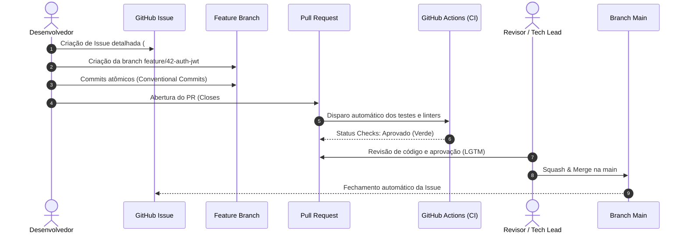
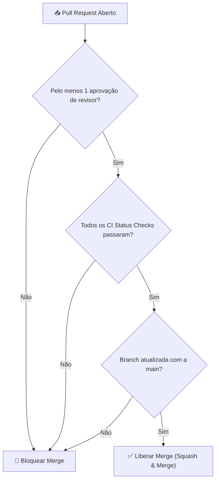

# 👥 Processos de Trabalho: Issues, PRs & Governança

> [!NOTE]
> O sucesso de projetos colaborativos — sejam open-source ou empresariais — depende de processos previsíveis e com baixo atrito. Este documento padroniza o ciclo de vida completo de **Issues**, **Pull Requests (PRs)**, **Code Review** e **Governança de Branches**.

---

## 🧭 1. Ciclo de Vida de uma Alteração (GitHub Flow)



---

## 📋 2. Padronização de Issues

### 2.1. Nomenclatura de Títulos
Utilize o prefixo correspondente ao tipo de demanda:
- `bug: falha na autenticação ao renovar token expirado`
- `feat: adicionar exportação de relatórios em formato CSV`
- `docs: atualizar guia de instalação rápida no README`
- `infra: migrar runner do CI para Ubuntu 24.04`

### 2.2. Taxonomia de Labels (Etiquetas)

| Categoria | Labels Típicas | Significado |
| :--- | :--- | :--- |
| **Tipo** | `bug`, `enhancement`, `documentation`, `refactor` | A natureza técnica da demanda |
| **Prioridade** | `priority: critical`, `priority: high`, `priority: low` | Urgência de atendimento |
| **Status** | `status: in-progress`, `status: blocked`, `needs-review` | Estado operacional no fluxo |
| **Comunidade** | `good first issue`, `help wanted` | Ideal para novos contribuidores |

---

## 🔀 3. Anatomia de um Pull Request Exemplar

### 3.1. Nomenclatura de Branches
Crie branches a partir da `main` atualizada utilizando convenções padronizadas:
- `feat/<ticket>-descricao-curta` (ex.: `feat/102-filtro-categorias`)
- `fix/<ticket>-descricao-curta` (ex.: `fix/88-memory-leak-worker`)
- `docs/<descricao-curta>` (ex.: `docs/revisar-readme`)
- `refactor/<descricao-curta>` (ex.: `refactor/modularizar-auth`)

### 3.2. Estrutura do Corpo do PR (`PULL_REQUEST_TEMPLATE.md`)

```markdown
## 📌 Descrição
Substitui a biblioteca de parsing de datas legado por `date-fns`, reduzindo o bundle final em 45KB e adicionando suporte completo a fusos horários da América Latina.

## 🎯 Motivação & Contexto
Resolve lentidão reportada na issue #45 e inconsistências de timezone no relatório financeiro.

## 🧪 Como Testar
1. Suba a aplicação localmente com `npm run dev`.
2. Acesse `/relatorios/fechamento`.
3. Selecione o período de 01/01 a 31/01 e verifique se as datas exibem o fuso UTC-3.
4. Execute a suite de testes automatizados: `npm test`.

## 📋 Checklist de Validação
- [x] Testes unitários adicionados/atualizados
- [x] Lint e formatação validados (`npm run check`)
- [x] Documentação atualizada (se aplicável)
- [x] Conventional Commits seguidos em todos os commits
- [x] Sem warnings ou dependências vulneráveis

## 📚 Documentação Original & Fontes de Referência

- 🌐 [Git SCM Official Documentation](https://git-scm.com/doc) — Documentação e livro Pro Git oficial.
- 🐙 [GitHub Docs](https://docs.github.com/) — Guias oficiais do GitHub sobre Actions, PRs, Security e API.
- 📦 [Conventional Commits 1.0.0 Specification](https://www.conventionalcommits.org/pt-br/v1.0.0/) — Especificação oficial em português.
- 🛡️ [SonarCloud Documentation](https://docs.sonarcloud.io/) & [Snyk Docs](https://docs.snyk.io/) — Guias oficiais de SAST e segurança.

---

## 🔗 Issues Relacionadas
Closes #45
```

> [!TIP]
> **Palavras-chave de Fechamento**: O GitHub reconhece `Closes #123`, `Fixes #123` ou `Resolves #123`. Quando o PR for mesclado na branch padrão, a issue indicada será fechada automaticamente.

---

## 🛡️ 4. Governança & Proteção de Branches

Para garantir a integridade do código em produção, a branch `main` deve possuir **Branch Protection Rules**:



### Configurações Recomendadas no Repositório:
1. **Require a pull request before merging**: Bloqueia pushes diretos na `main`.
2. **Require approvals**: Exige pelo menos 1 aprovação de revisores designados.
3. **Dismiss stale pull request approvals when new commits are pushed**: Invalida aprovações se novos commits forem adicionados.
4. **Require status checks to pass before merging**: Exige sucesso em jobs de CI (lint, tests, build).
5. **Require linear history**: Garante um histórico limpo sem commits de merge redundantes.

---

## 👥 5. Gestão de Responsáveis com `CODEOWNERS`

O arquivo `CODEOWNERS` (localizado na raiz ou em `.github/`) define automaticamente quais desenvolvedores ou times devem ser solicitados como revisores de acordo com os caminhos dos arquivos modificados:

```text
# .github/CODEOWNERS

# Por padrão, o mantenedor principal revisa todas as mudanças
* @pedroiff0

# Mudanças em CI/CD e workflows exigem revisão do time de DevOps
/.github/workflows/ @pedroiff0

# Documentação pode ser revisada por mantenedores de docs
/content/ @pedroiff0
```

---

## 🔗 Conexões do Segundo Cérebro

- Garanta que seus commits individuais estejam impecáveis com [[pt-br/github/conventional-commits|Conventional Commits]].
- Configure as automações de CI/CD exigidas pelas regras de proteção em [[pt-br/github/github-actions-cicd|GitHub Actions & CI/CD]].
- Integre varreduras de segurança automáticas em cada PR com [[pt-br/github/github-security-snyk-sonar|Segurança de Código (Snyk & Sonar)]].
