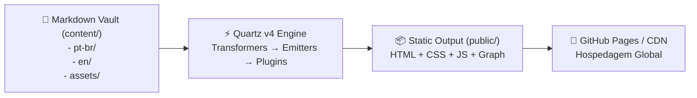

# 🌐 Digital Gardens com Quartz v4 & GitHub Pages

> [!NOTE]
> Um **Digital Garden (Jardim Digital)** é uma coleção viva de pensamentos, referências técnicas e documentações interconectadas. Ao contrário de um blog tradicional linear e cronológico, um jardim digital é navegado através de **grafos de conexões conceituais**, wikilinks bidirecionais e mapas de conhecimento.

---

## ⚡ 1. O que é o Quartz v4?

O **Quartz v4** é um gerador de sites estáticos (SSG) de altíssima performance construído sobre **Node.js, Preact, TypeScript e esbuild/lightningcss**. Ele analisa arquivos Markdown com frontmatter YAML, resolve links no estilo Obsidian (`[[nota]]` ou `[texto](caminho.md)`), gera grafos interativos em D3/Canvas e emite páginas HTML estáticas ultra-rápidas.



---

## 🌍 2. Arquitetura Multilíngue Espelhada (PT-BR / EN-US)

Para manter um digital garden bilíngue sem atrito:

1. **Pastas de Idioma em `content/`**:
   - `content/pt-br/modulo/topico.md`
   - `content/en/modulo/topico.md`
2. **Espelhamento Estrito de Slugs**:
   - Os nomes de arquivos e pastas devem ser idênticos entre os idiomas.
   - Isso permite que o componente `LanguageToggle.tsx` alterne instantaneamente entre Português e Inglês apenas trocando o segmento `/pt-br/` por `/en/` na URL atual sem páginas 404.
3. **Language Flattening no Explorer**:
   - As regras CSS de `custom.scss` ocultam a pasta raiz do outro idioma e desaninham as pastas do idioma ativo, fazendo com que os tópicos apareçam diretamente como itens de primeiro nível na barra lateral.

---

## 🕸️ 3. Configuração do Grafo de Conhecimento

O Quartz renderiza dois tipos de grafo via D3.js:

1. **Grafo Local (Local Graph)**: Exibido na barra lateral direita em cada página, mostrando apenas os nós vizinhos (profundidade configurável, padrão: 2).
2. **Grafo Global (Global Graph)**: Modal expansível em tela cheia que mapeia todo o ecossistema do repositório.

### Configuração em `quartz.config.yaml`:
```yaml
- source: github:quartz-community/graph
  enabled: true
  options:
    localGraph:
      drag: true
      zoom: true
      depth: 2
      scale: 1.1
      repelForce: 0.5
      centerForce: 0.3
      linkDistance: 35
      fontSize: 0.6
      showTags: true
    globalGraph:
      drag: true
      zoom: true
      depth: -1
      scale: 0.9
      repelForce: 0.5
      centerForce: 0.3
      linkDistance: 35
      fontSize: 0.6
      showTags: true
  layout:
    position: right
    priority: 10
```

---

## 🎨 4. Paleta de Cores e Tipografia

Você pode personalizar totalmente as fontes e cores no bloco `theme` do `quartz.config.yaml`:

```yaml
theme:
  fontOrigin: googleFonts
  cdnCaching: true
  typography:
    header: Schibsted Grotesk
    body: Source Sans Pro
    code: IBM Plex Mono
  colors:
    lightMode:
      light: "#ffffff"
      lightgray: "#f0f0f0"
      gray: "#cccccc"
      darkgray: "#333333"
      dark: "#111111"
      secondary: "#2c3e50"
      tertiary: "#34495e"
    darkMode:
      light: "#1a1a1a"
      lightgray: "#2d2d2d"
      gray: "#666666"
      darkgray: "#e0e0e0"
      dark: "#ffffff"
      secondary: "#5c8a8a"
      tertiary: "#7f8c8d"
```

---

## 🚀 5. Comandos Locais de Operação

```bash
# Instalar dependências
npm install

# Instalar plugins do Quartz declarados
npx quartz plugin install

# Iniciar servidor local de desenvolvimento (rebuild automático em http://localhost:8080)
npm run serve
# ou
npx quartz build --serve

# Executar compilação estática de produção
npm run build

# Validar tipos TypeScript
npm run check
```

---

## 🔗 Conexões do Segundo Cérebro

- Configure o workflow de deploy automatizado em [[pt-br/github/github-actions-cicd|GitHub Actions & CI/CD]].
- Aprenda como escrever notas técnicas com metadados ricos em [[../../skills/doc-authoring/SKILL|Skill de Autoria de Documentação]].
- Entenda como curar as conexões do grafo em [[../../skills/second-brain-graph/SKILL|Skill de Curadoria de Grafo]].
