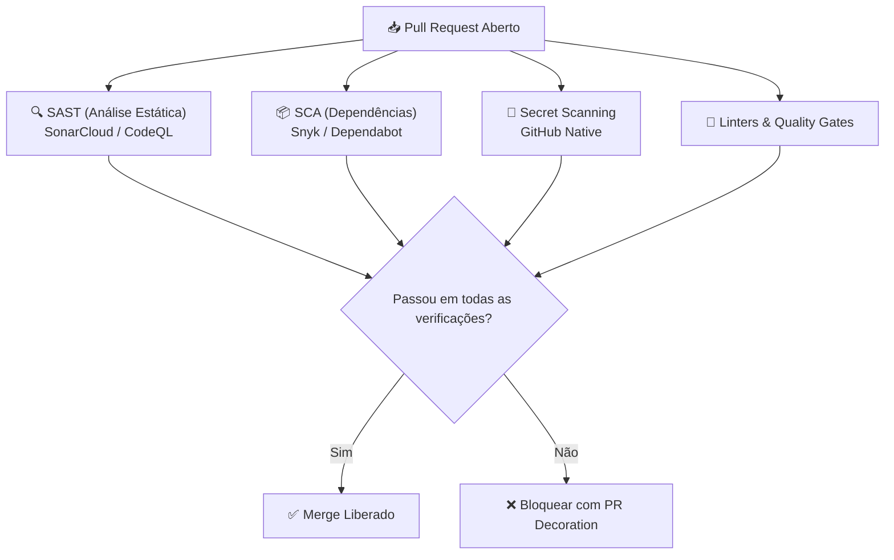

# 🛡️ Segurança de Código & Qualidade: Snyk, SonarCloud & CodeQL

> [!NOTE]
> A prática de **DevSecOps** consiste em deslocar a segurança e a qualidade para a esquerda (*Shift-Left Security*), identificando vulnerabilidades, falhas de arquitetura e dívida técnica no exato momento em que o código é escrito e submetido em um Pull Request.

---

## 🎯 1. Os Quatro Pilares de Auditoria Contínua



1. **SAST (Static Application Security Testing)**: Analisa o código-fonte em busca de falhas de lógica, injeções SQL, XSS e code smells (SonarCloud, CodeQL).
2. **SCA (Software Composition Analysis)**: Varre árvores de dependências diretas e transitivas em busca de CVEs conhecidas (Snyk, Dependabot).
3. **Secret Scanning**: Impede commits acidentais de chaves de API, certificados e tokens de nuvem.
4. **Quality Gates**: Regras automáticas que bloqueiam merges se a cobertura de testes diminuir ou a dívida técnica aumentar.

---

## ☁️ 2. SonarCloud: Qualidade & Quality Gates

O **SonarCloud** é o serviço em nuvem gerenciado da SonarSource para análise contínua de manutenibilidade, confiabilidade e segurança.

### 2.1. Métricas Principais Avaliadas:
- **Bugs**: Erros de lógica que causarão exceções em tempo de execução.
- **Vulnerabilities**: Brechas de segurança que podem ser exploradas diretamente.
- **Security Hotspots**: Trechos de código sensíveis que necessitam de revisão humana (ex.: criptografia, regex complexa).
- **Code Smells**: Problemas de design que aumentam a dívida técnica.
- **Coverage**: Porcentagem de linhas novas cobertas por testes automatizados (recomendado: mínimo 80%).

### 2.2. Workflow de Integração (GitHub Actions + Node.js):
```yaml
name: SonarCloud Analysis

on:
  push:
    branches:
      - main
  pull_request:
    types: [opened, synchronize, reopened]

jobs:
  sonarcloud:
    runs-on: ubuntu-latest
    steps:
      - uses: actions/checkout@v4
        with:
          fetch-depth: 0 # Análise profunda exige histórico git completo

      - name: Setup Node.js
        uses: actions/setup-node@v4
        with:
          node-version: 22

      - run: npm ci
      - run: npm test -- --coverage # Gera relatório lcov para o Sonar

      - name: SonarCloud Scan
        uses: SonarSource/sonarcloud-github-action@v2
        env:
          GITHUB_TOKEN: ${{ secrets.GITHUB_TOKEN }}
          SONAR_TOKEN: ${{ secrets.SONAR_TOKEN }}
```

---

## 🐶 3. Snyk: Análise de Dependências & Containers

O **Snyk** especializa-se em detectar vulnerabilidades em bibliotecas de terceiros (npm, pip, maven, cargo), imagens Docker e arquivos de infraestrutura como código (Terraform, Kubernetes).

### 3.1. Testes Locais com o Snyk CLI:
```bash
# Instalar CLI globalmente via npm
npm install -g snyk

# Autenticar conta
snyk auth

# Testar vulnerabilidades de dependências no diretório atual
snyk test

# Monitorar projeto (envia snapshot contínuo para o dashboard do Snyk)
snyk monitor

# Testar segurança de uma imagem Docker local
snyk container test minha-aplicacao:latest
```

### 3.2. Workflow do Snyk no GitHub Actions:
```yaml
name: Snyk Security Scan

on:
  push:
    branches: [main]
  pull_request:
    branches: [main]

jobs:
  security:
    runs-on: ubuntu-latest
    steps:
      - uses: actions/checkout@v4
      - name: Executar Snyk Test
        uses: snyk/actions/node@master
        env:
          SNYK_TOKEN: ${{ secrets.SNYK_TOKEN }}
        with:
          args: --severity-threshold=high # Bloqueia apenas vulnerabilidades Altas ou Críticas
```

---

## 🤖 4. Ferramentas Nativas do GitHub

### 4.1. Dependabot
Atualiza automaticamente dependências desatualizadas ou vulneráveis. Configure via `.github/dependabot.yml`:

```yaml
version: 2
updates:
  - package-ecosystem: "npm"
    directory: "/"
    schedule:
      interval: "weekly"
    open-pull-requests-limit: 5
    reviewers:
      - "pedroiff0"
    labels:
      - "dependencies"
      - "chore"

  - package-ecosystem: "github-actions"
    directory: "/"
    schedule:
      interval: "monthly"
```

### 4.2. CodeQL
O mecanismo semântico de análise de código da própria GitHub que trata código como dados para consultas de vulnerabilidade:

```yaml
name: "CodeQL Analysis"

on:
  push:
    branches: [main]
  pull_request:
    branches: [main]
  schedule:
    - cron: '0 12 * * 1' # Roda toda segunda-feira

jobs:
  analyze:
    runs-on: ubuntu-latest
    permissions:
      security-events: write
    steps:
      - uses: actions/checkout@v4
      - uses: github/codeql-action/init@v3
        with:
          languages: javascript-typescript
      - uses: github/codeql-action/autobuild@v3
      - uses: github/codeql-action/analyze@v3
```

---

## 📚 Documentação Original & Fontes de Referência

- 🌐 [Git SCM Official Documentation](https://git-scm.com/doc) — Documentação e livro Pro Git oficial.
- 🐙 [GitHub Docs](https://docs.github.com/) — Guias oficiais do GitHub sobre Actions, PRs, Security e API.
- 📦 [Conventional Commits 1.0.0 Specification](https://www.conventionalcommits.org/pt-br/v1.0.0/) — Especificação oficial em português.
- 🛡️ [SonarCloud Documentation](https://docs.sonarcloud.io/) & [Snyk Docs](https://docs.snyk.io/) — Guias oficiais de SAST e segurança.

---

## 🔗 Conexões do Segundo Cérebro

- Combine essas verificações de segurança no seu pipeline em [[pt-br/github/github-actions-cicd|GitHub Actions & CI/CD]].
- Aplique o bloqueio automático de PRs inseguros conforme [[pt-br/github/github-flow-processes|Processos de Trabalho & Governança]].
- Administre tokens e secrets com segurança usando [[pt-br/github/github-cli-api|GitHub CLI & API]].
