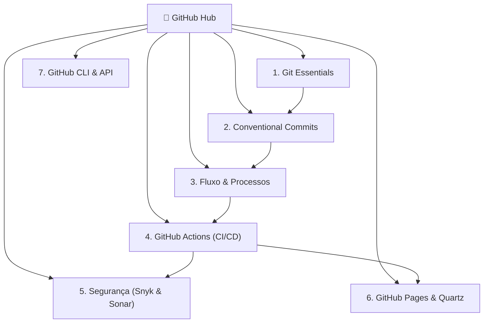

# 🐙 Ecossistema GitHub & Git: O Guia Definitivo

> [!NOTE]
> Este módulo reexplica de ponta a ponta todos os componentes vitais para engenharia de software colaborativa de alto nível no GitHub. Cada página traz uma visão conceitual aprofundada, comandos de terminal prontos para uso, boas práticas e armadilhas reais.

---

## 📚 Trilha de Aprendizado e Módulos

---

### 1. ⚙️ [[pt-br/github/git-essentials|Fundamentos & Mecânica Interna do Git]]
- A árvore de objetos do Git: *Blobs, Trees, Commits e Tags*.
- As três áreas: *Working Directory, Staging Area (Index) e HEAD*.
- Gestão de Branches, estratégias de Merge vs. Rebase iterativo.
- Manipulação temporal: `git stash`, `git cherry-pick`, `git reset` (soft, mixed, hard) e recuperação com `git reflog`.

### 2. 🌳 [[pt-br/github/git-submodules-subtrees|Git Submodules vs Git Subtrees: Repositórios Aninhados]]
- Gestão de mono-repos e dependências externas aninhadas.
- Diferenças entre apontamento por SHA e mesclagem de árvore embutida.
- Comandos essenciais de clonagem recursiva e sincronização com upstream.

### 3. 📝 [[pt-br/github/conventional-commits|Conventional Commits & Commits Semânticos]]
- Especificação oficial Conventional Commits 1.0.0.
- Taxonomia completa de tipos: `feat`, `fix`, `docs`, `style`, `refactor`, `perf`, `test`, `build`, `ci`, `chore`, `revert`.
- Regras estritas de formatação para *Header (Type, Scope, Subject)*, *Body* e *Footer*.
- Comunicação de Breaking Changes (`!` e `BREAKING CHANGE:`).
- Script bash e git hooks automatizados para validação prévia de commits.

### 3. 👥 [[pt-br/github/github-flow-processes|Processos de Trabalho: Issues, PRs & Governança]]
- Padrão de abertura de Issues com templates em Markdown / YAML Forms.
- Anatomia de um Pull Request exemplar: descrições ricas, checklists, passos de teste e fechamento automatizado (`Closes #123`).
- Nomenclatura profissional de branches (`feature/*`, `fix/*`, `refactor/*`).
- Governança de repositório: `CODEOWNERS`, Branch Protection Rules, Reviewers obrigatórios e Milestones.

### 4. 🚀 [[pt-br/github/github-actions-cicd|GitHub Actions & CI/CD Automatizado]]
- Arquitetura de Actions: *Workflows, Events/Triggers, Jobs, Runners e Steps*.
- Variáveis de ambiente, Secrets gerenciados e OIDC Tokens.
- Otimização de pipelines: Caching de dependências, Matrizes de execução multiplataforma (`matrix builds`) e concorrência.
- Reusable Workflows e Composite Actions para padronização corporativa.
- Deploy contínuo automatizado no GitHub Pages.

### 5. 🛡️ [[pt-br/github/github-security-snyk-sonar|Segurança de Código & Qualidade: Snyk, SonarCloud & CodeQL]]
- Integração de SAST (Static Application Security Testing) e SCA (Software Composition Analysis).
- **SonarCloud**: Análise contínua de code smells, cobertura de testes e imposição de *Quality Gates*.
- **Snyk**: Varredura de vulnerabilidades em dependências, imagens Docker e Infra-as-Code.
- **GitHub Native Security**: Dependabot version & security updates, CodeQL e Secret Scanning.

### 6. 🌐 [[pt-br/github/github-pages-quartz|Digital Gardens com Quartz v4 & GitHub Pages]]
- Transformação de anotações Markdown em websites estáticos ultra-rápidos.
- Estrutura de diretórios `content/` com suporte multilíngue espelhado (PT-BR / EN-US).
- Configuração de plugins, busca em tempo real, visualização em Grafo interativo e modo escuro/claro.
- Workflow automatizado de build e publicação via GitHub Pages Actions.

### 7. 💻 [[pt-br/github/github-cli-api|Produtividade com GitHub CLI (`gh`) & APIs]]
- Operações de Issues, Pull Requests, Releases e Secrets diretamente do terminal com `gh`.
- Automação e extração de métricas com GitHub REST API e GraphQL.
- Criação de extensões e aliases personalizados para o CLI.

---

> [!TIP]
> **Comece pelo início**: Se você deseja dominar o fluxo de trabalho desde a base, inicie lendo [[pt-br/github/git-essentials|Fundamentos do Git]] e avance sequencialmente pelos módulos.
