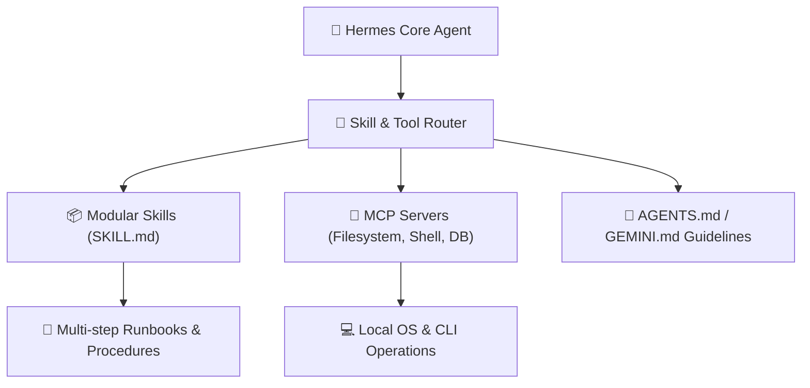

# 🦅 Hermes Agent: Automação Inteligente & Skills

> [!NOTE]
> **Status do Módulo**: Em expansão contínua. O ecossistema **Hermes** representa a nova geração de agentes autônomos de desenvolvimento, projetados para operar diretamente sobre terminais, repositórios Git e ferramentas locais através de um sistema modular de *Skills*.

---

## 🧭 Arquitetura do Sistema de Agentes Hermes

---

## 🗺️ Tópicos & Roadmap do Módulo

1. **O que é uma Skill (`SKILL.md`)?**:
   - Pacotes autocontidos de instruções especializadas, scripts e referências que ensinam o agente a executar tarefas complexas em etapas precisas.
   - Padrão de frontmatter YAML: `name`, `description`, `tags`, diretrizes operacionais.
2. **Progressive Disclosure (Divulgação Progressiva)**:
   - Como evitar saturação da janela de contexto injetando apenas o sumário das skills até o momento em que sua ativação é estritamente necessária.
3. **Padrão de Autoria de Skills de Alta Eficácia**:
   - Definição de pré-condições, passos determinísticos de verificação, tratamento de exceções e critérios de sucesso.
4. **Integração com Servidores MCP**:
   - Conexão do agente com ferramentas de sistema de arquivos, executores de comandos, navegadores headless e bancos de dados locais.
5. **Automação de Repositórios com Hermes**:
   - Criação de pipelines autônomos de revisão de código, geração de documentação e resolução de issues complexas.

---

## 📚 Documentação Original & Fontes de Referência

- 🦅 [Hermes Agent Official Repository](https://github.com/pedroiff0/devops-guide) — Arquitetura e manifesto de skills.
- 🛠️ [Agentic Coding Protocols](https://modelcontextprotocol.io/) — Especificações de interação autônoma de ferramentas.

---

## 🔗 Conexões do Segundo Cérebro

- Conheça as skills nativas deste repositório em [[../../skills/README|Skills do Repositório]].
- Combine agentes com [[pt-br/claude/index|Claude & Engenharia de IA]].
- Automatize commits semânticos gerados por agentes com [[pt-br/github/conventional-commits|Conventional Commits]].
- Retorne ao [[pt-br/index|Hub Central de Documentações]].
