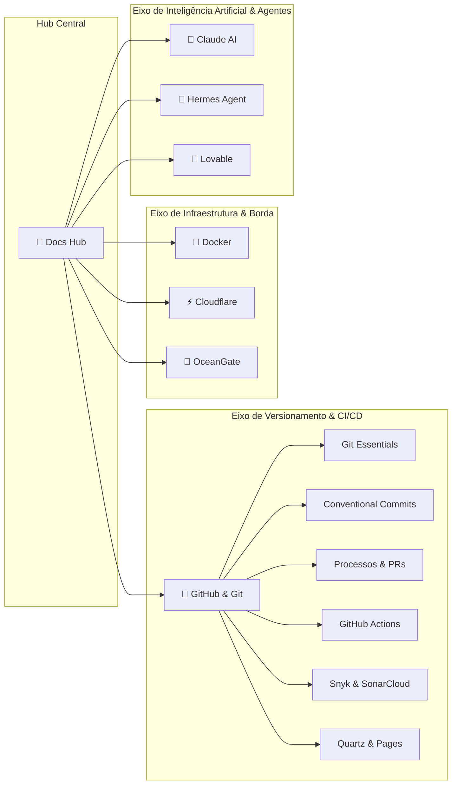

# 🧠 Hub Central de Documentações Reexplicadas

> [!NOTE]
> **Visão do Projeto**: Documentações oficiais costumam ser densas, dispersas ou puramente descritivas. O objetivo deste **Segundo Cérebro** é reexplicar ferramentas e ecossistemas sob a ótica de engenharia prática: com diagramas conceituais, comandos prontos para produção, armadilhas comuns e conexões bidirecionais navegáveis.

---

## 🗺️ Mapa de Ecossistemas & Tecnologias

Cada pilar abaixo conta com seu próprio módulo aprofundado e nível dedicado na barra lateral:

### 1. 🐙 [[pt-br/github/index|Guia GitHub & Git (Módulo Completo)]]
O ecossistema completo de desenvolvimento colaborativo, versionamento e automação:
- [[pt-br/github/git-essentials|Fundamentos do Git]]: Comandos essenciais, arquitetura interna, branches, rebase, stash, cherry-pick e reflog.
- [[pt-br/github/conventional-commits|Conventional Commits]]: Especificação 1.0.0, taxonomia de tipos, escopos, breaking changes e validação via hooks.
- [[pt-br/github/github-flow-processes|Processos & Governança]]: Ciclo de vida de Issues, PRs, Code Review, Branch Protection, CODEOWNERS e Milestones.
- [[pt-br/github/github-actions-cicd|GitHub Actions & CI/CD]]: Workflows automatizados, triggers, runners, secrets, caching, matrix builds e deploy.
- [[pt-br/github/github-security-snyk-sonar|Segurança & Qualidade]]: Integração com Snyk (SCA/SAST), SonarCloud (Quality Gates), Dependabot e CodeQL.
- [[pt-br/github/github-pages-quartz|GitHub Pages & Quartz v4]]: Publicação de digital gardens, configuração de temas e hospedagem estática.
- [[pt-br/github/github-cli-api|GitHub CLI & API REST/GraphQL]]: Produtividade máxima no terminal com o utilitário `gh` e scripts.

---

### 2. 🐳 [[pt-br/docker/index|Docker & Containers (Em Construção)]]
Arquitetura de virtualização leve, containerização, isolamento de processos, Dockerfile multi-stage, volumes persistentes, redes bridge/overlay e orquestração local com Docker Compose.

---

### 3. ⚡ [[pt-br/cloudflare/index|Cloudflare Ecosystem (Em Construção)]]
A plataforma de borda global: Cloudflare Workers (serverless V8 isolates), Pages, KV & R2 storage, Zero Trust, Tunnels seguros (`cloudflared`), DNS gerenciado e otimização de CDN.

---

### 4. 🤖 [[pt-br/claude/index|Claude & Engenharia de IA (Em Construção)]]
Domínio de modelos de linguagem da Anthropic: Prompt Engineering avançado, gestão de context window de 200k+ tokens, Claude Code CLI, geração de Artifacts e orquestração de subagentes.

---

### 5. 🦅 [[pt-br/hermes/index|Hermes Agent & Skills (Em Construção)]]
Desenvolvimento de agentes autônomos de código: Criação de `SKILL.md`, manipulação de ferramentas MCP (Model Context Protocol), hooks de ciclo de vida e automação contínua.

---

### 6. 💖 [[pt-br/lovable/index|Lovable & IA Full-Stack (Em Construção)]]
Aceleração de desenvolvimento web moderno assistido por IA: Arquitetura de aplicações React/Vite com Tailwind CSS, integração nativa com Supabase e boas práticas de prototipagem.

---

### 7. 🌊 [[pt-br/oceangate/index|OceanGate / OpenGate & Edge (Em Construção)]]
Gateways de borda, proxies reversos de alta performance, balanceamento de carga e arquiteturas distribuídas tolerantes a falhas.

---

## 🕸️ Grafo de Conexões do Segundo Cérebro

---

> [!TIP]
> **Como contribuir**: Consulte as [[../../skills/README|Skills do Repositório]] para aprender o fluxo de trabalho, padrões de escrita e comandos de validação local.
