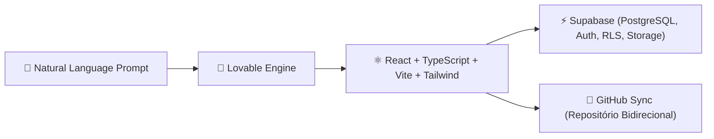

# 💖 Lovable: Desenvolvimento Full-Stack Acelerado por IA

> [!NOTE]
> **Status do Módulo**: Em expansão contínua. O **Lovable** permite a prototipagem e desenvolvimento de aplicações web completas em tempo recorde através de IA generativa, gerando código React/TypeScript moderno com integração instantânea a bancos de dados PostgreSQL (Supabase).

---

## 🧭 Arquitetura de Aplicações Lovable

---

## 🗺️ Tópicos & Roadmap do Módulo

1. **Arquitetura Gerada pelo Lovable**:
   - Estrutura de diretórios limpa baseada em componentes shadcn/ui e Tailwind CSS.
   - Padrões de estado com React Query e gerenciamento de rotas com React Router.
2. **Integração Nativa com Supabase**:
   - Autenticação de usuários (Email, Magic Links, Provedores OAuth).
   - Políticas de Segurança a Nível de Linha (*Row Level Security - RLS*).
   - Criação de tabelas, relacionamentos e triggers via migrações SQL.
3. **Sincronização Bidirecional com GitHub**:
   - Como conectar o Lovable ao seu repositório GitHub para que alterações na interface reflitam em commits limpos e vice-versa.
4. **Boas Práticas para Evitar Alucinações de Código**:
   - Estruturação de prompts incrementais e modulares.
   - Criação de especificações arquiteturais claras antes da geração de telas.

---

## 🔗 Conexões do Segundo Cérebro

- Versionamento e CI/CD para projetos Lovable com [[pt-br/github/github-actions-cicd|GitHub Actions]].
- Estruturação de branches e commits com [[pt-br/github/conventional-commits|Conventional Commits]].
- Retorne ao [[pt-br/index|Hub Central de Documentações]].
