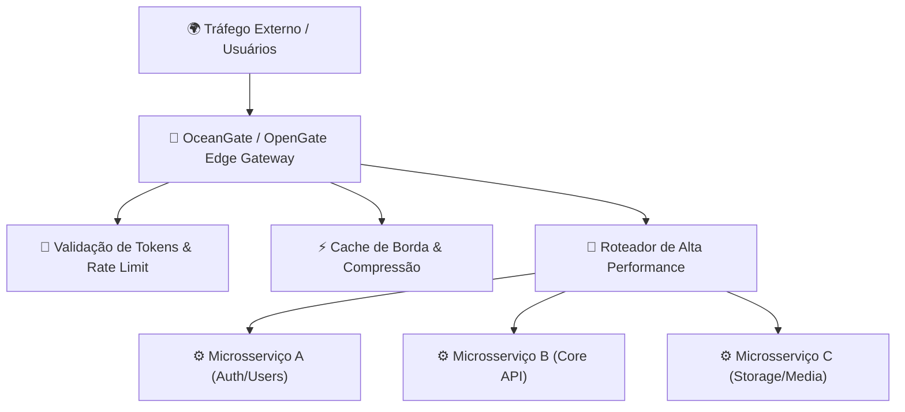

# 🌊 OceanGate / OpenGate: Arquitetura de Borda & Gateways

> [!NOTE]
> **Status do Módulo**: Em expansão contínua. O pilar **OceanGate / OpenGate** aborda os desafios modernos de roteamento de tráfego em larga escala, segurança de perímetro, rate limiting, balanceamento de carga inteligente e observabilidade de borda.

---

## 🧭 Arquitetura de Gateway & Borda

---

## 🗺️ Tópicos & Roadmap do Módulo

1. **Fundamentos de API Gateways Modernos**:
   - Centralização de preocupações transversais (*Cross-Cutting Concerns*): autenticação, TLS termination, CORS e logging.
   - Padrão *Backend for Frontend (BFF)* vs. Gateway Unificado.
2. **Estratégias de Rate Limiting & Proteção contra Abusos**:
   - Algoritmos de *Token Bucket*, *Leaky Bucket* e *Sliding Window Counters*.
   - Isolamento de tráfego por IP, chave de API ou usuário autenticado.
3. **Resiliência & Tolerância a Falhas**:
   - Padrões de *Circuit Breaker*, *Retries* com backoff exponencial e *Fallbacks* automáticos.
4. **Integração com Borda & Nuvem**:
   - Conexão com [[pt-br/cloudflare/index|Cloudflare Workers & Tunnels]].
   - Monitoramento de métricas em tempo real com Prometheus e Grafana.

---

## 📚 Documentação Original & Fontes de Referência

- 🌊 [OceanGate API Gateway Architecture](https://devops.phrandrade.com) — Especificação de roteamento de borda e rate limiting.
- ⚡ [Redis Documentation](https://redis.io/docs/) — Algoritmos de controle de vazão e estruturas de dados em memória.

---

## 🔗 Conexões do Segundo Cérebro

- Orquestre serviços de backend com [[pt-br/docker/index|Docker & Containers]].
- Conecte o gateway a túneis seguros com [[pt-br/cloudflare/index|Cloudflare Ecosystem]].
- Retorne ao [[pt-br/index|Hub Central de Documentações]].
