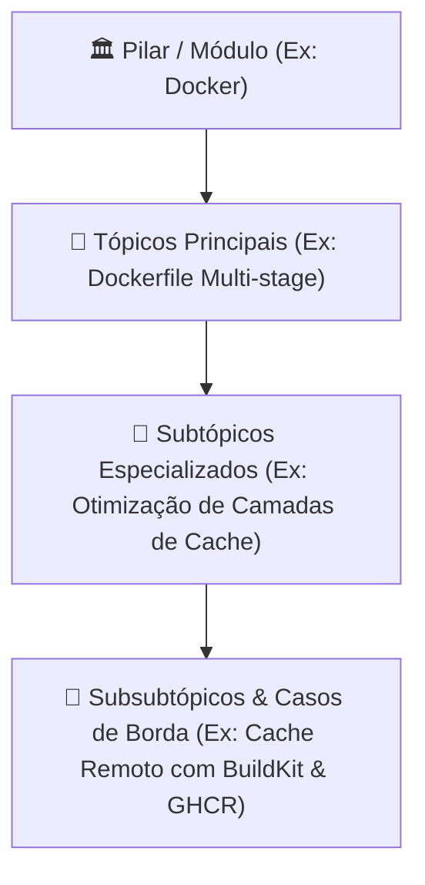

# 🏛️ Skill: Arquitetura & Desenho Estrutural de Conteúdo

Esta skill orienta o desenho arquitetural de qualquer novo ecossistema ou pilar técnico no repositório.

---

## 🧭 1. Níveis Hierárquicos de Conteúdo

Cada tecnologia neste repositório é dividida em 3 camadas de profundidade:

### 1.1. Nível 1: Pilar / Módulo (`content/pt-br/<modulo>/index.md`)
- Visão panorâmica de engenharia do ecossistema.
- Diagrama arquitetural macro em Mermaid.
- Índice de navegação sequencial com ordem (`order`).

### 1.2. Nível 2: Tópicos Principais (`content/pt-br/<modulo>/<topico>.md`)
- Fundamentos conceituais e como a ferramenta opera internamente.
- Comparativos objetivos de alternativas.

### 1.3. Nível 3: Subtópicos & Subsubtópicos
- Arquivos de configuração de produção completos.
- Exemplos reais de uso no terminal ou em código.
- Troubleshooting de erros frequentes e armadilhas.

---

## 🕸️ 2. Topologia do Grafo & Referências Cruzadas

Ao projetar uma nova arquitetura de conteúdo:
1. **Identifique Dependências Conceituais**: Por exemplo, um guia de *Deploy no Cloudflare Workers* deve ter referências cruzadas para [[pt-br/github/github-actions-cicd|GitHub Actions CI/CD]].
2. **Defina Tags em Kebab-case**: Use tags transversais (`devops`, `containers`, `serverless`, `seguranca`) que formam pontes entre diferentes módulos.
3. **Seção de Conexões no Rodapé**: Toda nota deve finalizar com uma seção `## 🔗 Conexões do Segundo Cérebro` contendo links de navegação.

---

## 📋 Checklist de Desenho Arquitetural

- [ ] A pasta do módulo foi criada simultaneamente em `content/pt-br/` e `content/en/`?
- [ ] O arquivo `index.md` possui um diagrama Mermaid ilustrando o fluxo?
- [ ] A ordem (`order: 10, 20...`) foi definida no frontmatter?
- [ ] As referências cruzadas apontam para tópicos existentes no grafo?
