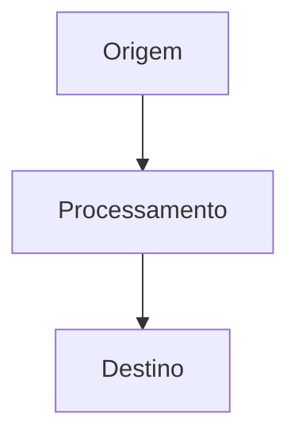

# ✍️ Skill: Autoria de Documentações Reexplicadas

Esta skill orienta a criação e edição de notas de documentação no repositório **Guia GitHub & Segundo Cérebro**.

---

## 🎯 Princípios Fundamentais

1. **Reexplicação Prática e Arquitetural**: Não apenas copie a documentação oficial. Reexplique os conceitos com base em princípios de engenharia de software, fluxos de dados, vantagens e desvantagens.
2. **Espelhamento Bilíngue Obrigatório**: Qualquer nova página criada em `content/pt-br/` DEVE ter sua contraparte equivalente em `content/en/` com o mesmo slug relativo.
3. **Densidade de Conexões (Grafo)**: Inclua links conceituais bidirecionais (`[[caminho/slug|Título]]`) no corpo da nota e no rodapé.
4. **Comandos Prontos para Produção**: Todos os blocos de código devem ser executáveis e incluir comentários explicativos.

---

## 📋 Schema Padrão de Frontmatter YAML

Toda nota em `content/**/*.md` DEVE iniciar com o seguinte bloco:

```yaml
---
title: "Título Claro e Conciso"
description: "Descrição concisa (1-2 frases) para metadados SEO, pré-visualizações de links e cards do Quartz."
order: 10 # Inteiro para ordenação no Explorer da barra lateral (10, 20, 30...)
tags:
  - topico-principal
  - tecnologia
  - categoria
---
```

---

## 🎨 Elementos Visuais e Callouts Suportados

### 1. GitHub-Flavored Callouts / Alerts:
```markdown
> [!NOTE]
> Informações contextuais, visões conceituais ou detalhes arquiteturais.

> [!TIP]
> Dicas práticas de produtividade, atalhos e recomendações recomendadas.

> [!IMPORTANT]
> Requisitos mandatórios e passos essenciais para o funcionamento.

> [!WARNING]
> Alertas de incompatibilidade, riscos de performance ou breaking changes.

> [!CAUTION]
> Ações destrutivas com risco de perda de dados ou exposição de segredos.
```

---

### 2. Diagramas Mermaid:
Sempre use blocos de código ````mermaid```` para ilustrar fluxos, grafos de decisão e interações de componentes:

````markdown

````

---

### 3. Links Bidirecionais para o Grafo:
- Em `pt-br/`: `[[pt-br/github/git-essentials|Fundamentos do Git]]`
- Em `en/`: `[[en/github/git-essentials|Git Essentials]]`

---

## 🔄 Procedimento Passo a Passo de Criação

1. **Determinar o Módulo**: Identifique a pasta pai em `content/pt-br/<modulo>/` e `content/en/<modulo>/`.
2. **Definir o Slug**: Escolha um nome em kebab-case claro (ex.: `git-essentials.md`).
3. **Escrever a versão PT-BR**: Desenvolva o conteúdo em português com frontmatter completo, diagramas e callouts.
4. **Escrever a versão EN-US**: Crie a versão espelhada em inglês com o mesmo nome de arquivo.
5. **Verificar a Compilação**:
   ```bash
   npx quartz build
   ```
6. **Verificar a Navegação Local**:
   ```bash
   npm run serve
   ```
