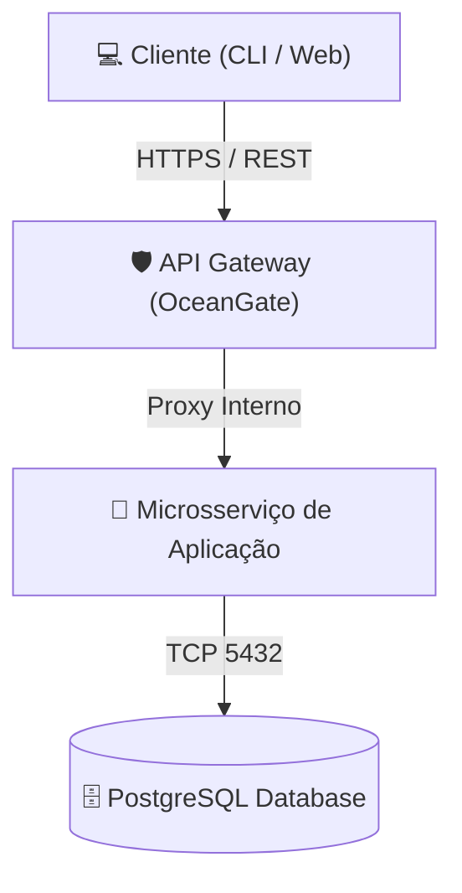

# ✍️ Skill: Padrões de Autoria de Documentação Reexplicada

Esta skill define as diretrizes estritas de formatação, metadados, recursos visuais e curadoria técnica para todas as notas deste repositório.

---

## 📜 1. Frontmatter Schema Obrigatório

Toda nota em `content/**/*.md` **DEVE** iniciar com o seguinte cabeçalho YAML:

```yaml
---
title: "Título Conciso com Beautiful Icon (Ex: 🐳 Docker Engine)"
author: "Pedro Andrade & Everton"
authors: # Opcional: lista de múltiplos autores humanos e agentes IA
  - "Pedro Andrade"
  - "Everton"
  - "Antigravity"
  - "Claude"
  - "Hermes"
publish: true
ai_assisted: true # Opcional: true se co-escrito com agentes de IA
description: "Resumo executivo de alto valor em 1 a 2 frases para SEO e cards de compartilhamento."
order: 10 # Inteiro para ordenação na barra lateral (10, 20, 30...)
tags:
  - tag-primaria
  - tag-secundaria
---
```

> [!NOTE]
> - `publish: true`: Garante que a nota seja processada e indexada no grafo.
> - `author` / `authors`: Atribui o crédito formal aos curadores humanos e aos agentes de IA colaboradores.
> - `ai_assisted: true`: Sinaliza que o conteúdo teve suporte de agentes de IA na curadoria e estruturação.
> - **Segurança & Licença Livre**: **NUNCA** inclua senhas, credenciais, tokens privados ou dados sensíveis. Todo o código é aberto e livre sob a licença MIT.

---

## 🤖 2. Seção de Transparência: Conteúdo Escrito / Assistido por IA

Caso o conteúdo seja produzido ou co-escrito com o auxílio de agentes de IA (Antigravity, Claude Code, Hermes, Cursor), inclua a flag no frontmatter e o callout de transparência técnica:

```markdown
> [!NOTE]
> 🤖 **Curadoria & Co-criação Assistida por IA**
> Este documento foi estruturado e co-escrito com o auxílio de agentes de IA avançados sob supervisão técnica humana, com validação estrita contra a documentação oficial da tecnologia.
```

---

## 🎨 3. Uso de Beautiful Icons em Todo Lugar

Para manter uma interface visualmente rica e de rápida leitura cognitiva:
- **Títulos e Cabeçalhos**: Sempre inclua um ícone expressivo no título `H1` e nas seções principais `H2` (ex.: `## 🏗️ 1. Arquitetura`, `## 💻 2. Guia Prático`, `## ⚠️ 3. Armadilhas Comuns`).
- **Callouts**: Utilize alertas com ícones de destaque (`[!NOTE]`, `[!TIP]`, `[!IMPORTANT]`, `[!WARNING]`, `[!CAUTION]`).
- **Listas & Tabelas**: Utilize badges e ícones de status (`🟢 Concluído`, `🟡 Em Progresso`, `⚡ Rápido`, `🔒 Seguro`).

---

## 📊 4. Regras de Ouro para Diagramas Mermaid à Prova de Falhas

Para evitar quebras de renderização no Quartz e garantir diagramas limpos:



### Diretrizes Estruturais:
1. **Sempre Use Aspas Duplas nos Labels**: Qualquer texto com espaços, parênteses, emojis ou caracteres especiais **DEVE** estar entre aspas duplas dentro dos colchetes:
   - ✅ Correto: `NodeA["🐳 Docker Daemon (dockerd)"]`
   - ❌ Errado: `NodeA[🐳 Docker Daemon (dockerd)]`
2. **Quebras de Linha em Labels**: Use `<br>` explicitamente dentro das aspas: `NodeB["Linha 1<br>Linha 2"]`.
3. **Direção Explícita**: Declare `graph TD` (cima para baixo) ou `graph LR` (esquerda para direita).
4. **Subgraphs Delimitados**: Sempre feche `subgraph` com `end`.
5. **Tipos de Diagramas Recomendados**:
   - `graph TD` / `graph LR`: Arquiteturas, topologias e pipelines.
   - `sequenceDiagram`: Fluxos temporais de requisições e autenticações.
   - `stateDiagram-v2`: Ciclos de vida de containers, pods e estados de transição.

---

## 📚 5. Seção Mandatória: Documentação Original & Fontes Oficiais

> [!IMPORTANT]
> **Princípio da Não-Invenção**: Nada neste repositório é inventado. Todo o conteúdo resulta de uma curadoria aprofundada de documentações oficiais, especificações OCI, RFCs ou referências de engenharia de software reais.

Toda nota técnica reexplicada **DEVE** incluir a seção final antes dos backlinks:

```markdown
## 📚 Documentação Original & Fontes de Referência

- 🌐 [Documentação Oficial do Docker Engine](https://docs.docker.com/engine/) — Visão oficial da arquitetura e CLI.
- 📦 [Open Container Initiative (OCI) Runtime Spec](https://github.com/opencontainers/runtime-spec) — Especificação técnica do runc e containerd.
- 🐧 [Kernel Linux: Control Groups v2](https://www.kernel.org/doc/Documentation/cgroup-v2.txt) — Documentação oficial do kernel sobre cgroups.
```

---

## 🔗 6. Conexões do Segundo Cérebro (Wikilinks)

Utilize wikilinks para alimentar o grafo D3 interativo:
- Em `content/pt-br/`: `[[pt-br/github/git-essentials|Fundamentos do Git]]`
- Em `content/en/`: `[[en/github/git-essentials|Git Essentials]]`
