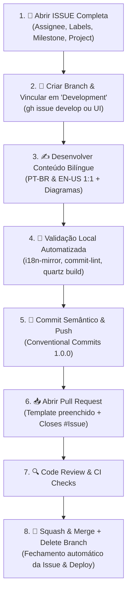

# 🐙 Skill: Fluxo Ágil Completo — Issues, Branches, Commits & PRs

Esta skill é o **guia de referência absoluto e determinístico** para qualquer desenvolvedor humano ou agente de IA que deseje introduzir novos conteúdos, correções ou melhorias neste repositório.

---

## 🔄 Visão Geral do Ciclo Ágil de Contribuição



---

## 📋 Passo a Passo Detalhado

### 1. Registrar a Issue com 100% dos Metadados Preenchidos

Toda contribuição começa com uma Issue bem documentada. É obrigatório preencher **todos os campos de governança**:

#### Campos Obrigatórios:
- **Title**: Formato `<tipo>(<escopo>): <descrição curta>` (ex.: `feat(cloudflare): documentar Workers, KV e Zero Trust`).
- **Body**: Template Markdown preenchido com:
  - `## 📌 Resumo / Summary`
  - `## 🎯 Contexto & Motivação / Context & Motivation`
  - `## 🗺️ Tópicos Propostos / Proposed Topics`
  - `## 📋 Critérios de Aceitação / Acceptance Criteria`
- **Assignee**: Atribua a si mesmo e/ou ao co-mantenedor (`--add-assignee pedroiff0`).
- **Labels**: Categorias aplicáveis (`--label "documentation,enhancement,i18n"`).
- **Milestone**: Associe ao Milestone ativo (ex.: `--milestone "v1.1.0 — Core Ecosystem Expansion"`).
- **Project**: Vincule ao quadro de projetos do repositório.

#### Comando no Terminal (GitHub CLI):
```bash
gh issue create \
  --title "feat(nome-modulo): descricao concisa da melhoria" \
  --body-file .github/ISSUE_TEMPLATE/docs.md \
  --add-assignee "@me" \
  --label "documentation,enhancement" \
  --milestone "v1.1.0 — Core Ecosystem Expansion"
```

---

### 2. Criar a Branch de Trabalho & Vincular no Campo `Development`

> [!IMPORTANT]
> **Regra Crucial de Rastreabilidade**:
> Imediatamente após criar a branch de trabalho, é **obrigatório voltar à Issue no GitHub e vincular a branch criada na seção `Development`** no painel lateral direito. Isso conecta o progresso no painel do GitHub e nos quadros de Projects.

#### Opção A — Automático via GitHub CLI (Recomendado):
O comando nativo `gh issue develop` cria a branch remota, conecta-a instantaneamente na seção **Development** da Issue e faz o checkout local:

```bash
# Exemplo para a Issue #17:
gh issue develop 17 --name feat/17-cloudflare-workers-pages --checkout
```

#### Opção B — Manual via Interface Web do GitHub:
1. Acesse a Issue no GitHub (`https://github.com/pedroiff0/devops-guide/issues/<id>`).
2. No menu lateral direito, localize a seção **Development**.
3. Clique em **"Create a branch"** ou **"Link a branch"**.
4. Defina o nome da branch: `feat/<issue-id>-<slug-curto>`.
5. No terminal local, puxe a branch criada:
   ```bash
   git fetch origin
   git checkout feat/<issue-id>-<slug-curto>
   ```

---

### 3. Autoria Técnica & Espelhamento Bilíngue

- **Estrutura Frontmatter Obrigatória**:
  ```yaml
  ---
  title: "Título Conciso"
  author: "Pedro Andrade & Everton"
  description: "Resumo executivo de 1 a 2 frases para SEO."
  order: 10
  tags:
    - tag-primaria
    - tag-secundaria
  ---
  ```
- **Simetria 1:1**: Todo arquivo em `content/pt-br/<modulo>/<pagina>.md` **DEVE** ter seu correspondente exato em `content/en/<modulo>/<pagina>.md`.
- **Qualidade de Engenharia**: Sem exemplos infantis ou simplistas ("Hello World"). Sempre inclua diagramas Mermaid, configurações reais e armadilhas comuns.

---

### 4. Bateria de Validação Local

Antes de commitar, execute a bateria completa de testes locais:

```bash
# 1. Validar simetria dos arquivos Markdown (PT-BR vs EN-US)
python3 scripts/check-i18n-mirror.py

# 2. Validar conformidade de commits anteriores
./scripts/validate-commit-msg.sh origin/main..HEAD

# 3. Validar compilação estática e integridade de links do Quartz
npm run build
```

---

### 5. Commits Semânticos (Conventional Commits 1.0.0)

Formato: `<type>(<scope>): <subject>`

Tipos permitidos: `feat`, `fix`, `docs`, `style`, `refactor`, `perf`, `test`, `build`, `ci`, `chore`, `revert`.

```bash
git add .
git commit -m "feat(modulo): adicionar documentacao reexplicada em pt-br e en"
git push -u origin feat/<issue-id>-<slug-curto>
```

---

### 6. Abertura do Pull Request com Metadados Completos

Abra o PR utilizando o template oficial, preenchendo todos os campos e vinculando a palavra-chave de fechamento:

```bash
gh pr create \
  --title "feat(modulo): expandir documentacao reexplicada com arquitetura e producao" \
  --body "## 📌 Descrição / Description
Adiciona guias aprofundados sobre o modulo X...

## 🎯 Motivação & Contexto / Motivation & Context
Resolve a Issue #<issue-id> com suporte bilingue integral.

## 🧪 Como Testar / How to Test
1. Execute \`npm run serve\`
2. Acesse \`http://localhost:8080/pt-br/<modulo>/\`

## 📋 Checklist de Validação
- [x] Build local executado com sucesso (\`npm run build\`)
- [x] Espelhamento multilíngue verificado (\`check-i18n-mirror.py\`)
- [x] Commits semânticos validados

## 🔗 Issues Relacionadas
Closes #<issue-id>" \
  --add-assignee "@me" \
  --label "documentation" \
  --milestone "v1.1.0 — Core Ecosystem Expansion"
```

---

### 7. Code Review & Status Checks

- Verifique se os workflows do GitHub Actions (`CI & Build Verification`) passaram com sucesso (verde `✓`).
- O revisor ou mantenedor analisa as alterações e aprova:
  ```bash
  gh pr review <pr-number> --comment -b "Revisão técnica aprovada: simetria bilíngue e build validados."
  ```

---

### 8. Squash & Merge, Exclusão de Branch e Deploy

O fechamento do ciclo é executado de forma limpa via Squash:

```bash
gh pr merge <pr-number> --squash --delete-branch
```

- **Efeito Automático**:
  1. A branch de trabalho é excluída local e remotamente.
  2. A Issue vinculada no campo `Development` e no corpo (`Closes #id`) é **fechada automaticamente**.
  3. O workflow `Deploy to GitHub Pages` é disparado na branch `main`, publicando a atualização em **[octa.phrandrade.com](https://octa.phrandrade.com)**.
