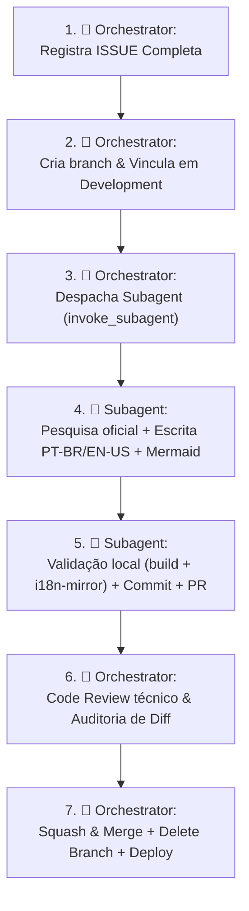

# 🐙 Skill: Pipeline de Orquestração com Subagentes (GitHub Pipeline)

Esta skill estabelece o modelo de trabalho colaborativo entre um **Agente Orquestrador** e **Subagentes Especializados** para desenvolvimento e expansão contínua deste repositório.

---

## 👥 Divisão de Papéis e Responsabilidades

| Papel | Responsabilidade Principal |
| :--- | :--- |
| **👑 Orchestrator (Agente Principal)** | Registrar a ISSUE completa (Assignee, Labels, Milestone, Project), criar e vincular a branch em `Development`, despachar subagentes, realizar Code Review, executar Squash & Merge e excluir branches. |
| **🤖 Subagent (`invoke_subagent` / `delegate_task`)** | Executar a pesquisa técnica nas documentações oficiais, redigir o conteúdo 100% espelhado (PT-BR e EN-US), desenhar diagramas Mermaid, rodar validação local e submeter o PR com checklist preenchido. |

---

## 🔄 Fluxo de Execução do Pipeline



---

## 🛠️ Passo a Passo de Operação

### 1. Orchestrator Registra a ISSUE Completa:
```bash
gh issue create \
  --title "feat(<modulo>): <descricao da melhoria>" \
  --body-file .github/ISSUE_TEMPLATE/docs.md \
  --add-assignee "@me" \
  --label "documentation,enhancement,i18n" \
  --milestone "v1.1.0 — Core Ecosystem Expansion"
```

### 2. Orchestrator Cria a Branch & Conecta no Campo `Development`:
```bash
gh issue develop <issue-id> --name feat/<issue-id>-<slug-curto> --checkout
```

---

### 3. Orchestrator Despacha o Subagent com Contexto Estrito:

```python
invoke_subagent(
    Subagents=[
        {
            "TypeName": "self", # ou research
            "Role": "Technical Author & Reviewer",
            "Prompt": """
            Objetivo: Implementar o conteúdo da Issue #<issue-id>: <titulo>.
            Branch atual: feat/<issue-id>-<slug-curto>
            
            Diretrizes Mandatórias:
            1. Leia atentamente: AGENTS.md, skills/doc-authoring e skills/re-explained-authoring.
            2. Autoria 100% simétrica em PT-BR (content/pt-br/) e EN-US (content/en/).
            3. Frontmatter obrigatório: title, author, publish: true, order, tags.
            4. Diagramas Mermaid: use aspas duplas em todos os nós (Node["🐳 Docker"]).
            5. Seção obrigatória: '## 📚 Documentação Original & Fontes de Referência'.
            6. Validação local: execute 'python3 scripts/check-i18n-mirror.py' e 'npm run build'.
            7. Commits semânticos: formato 'feat(<modulo>): <descricao>'.
            8. Abrir Pull Request com 'Closes #<issue-id>' e template preenchido.
            """
        }
    ]
)
```

---

### 4. Subagent Executa o Trabalho (Paralelo):
- Lê documentação oficial autoritativa (sem invenção).
- Cria as notas técnicas em `content/pt-br/` e `content/en/`.
- Executa a bateria de validações locais:
  ```bash
  python3 scripts/check-i18n-mirror.py
  npm run build
  ```
- Realiza commits atômicos e abre o PR:
  ```bash
  git add .
  git commit -m "feat(<modulo>): <descricao da mudanca>"
  git push -u origin feat/<issue-id>-<slug-curto>
  gh pr create --title "feat(<modulo>): <titulo>" --body "Closes #<issue-id>..."
  ```

---

### 5. Orchestrator Realiza o Code Review:
- Audita o diff do PR:
  ```bash
  gh pr diff <pr-id>
  ```
- Confirma que o espelhamento bilíngue está intacto e os status checks estão verdes (`✓`).
- Aprova a submissão.

---

### 6. Orchestrator Executa o Merge e Limpeza:
```bash
gh pr merge <pr-id> --squash --delete-branch
```
- A branch é deletada.
- A Issue vinculada em `Development` é encerrada automaticamente.
- O site é compilado e publicado no GitHub Pages (`devops.phrandrade.com`).

---

## ⚡ Gestão de Concorrência & Paralelismo

- **Limite de Subagentes**: Máximo de 3 subagentes paralelos trabalhando em módulos distintos (ex.: um em `cloudflare`, outro em `claude`, outro em `hermes`).
- **Desacoplamento**: Cada subagent deve operar exclusivamente dentro do seu diretório de módulo para evitar conflitos de merge no Git.
- **Resolução de Conflitos**: Caso dois subagentes alterem o mesmo índice global, o Orchestrator realiza o rebase e reconciliação dos links.
