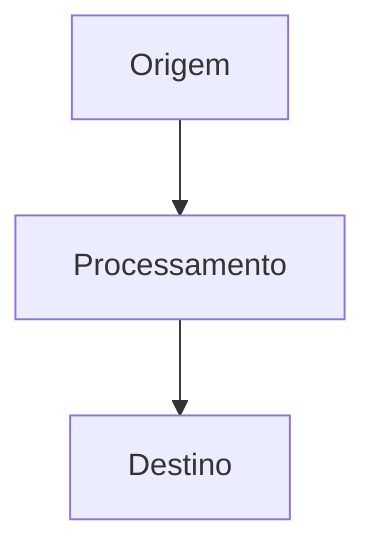

# ✍️ Skill: Escrita de Guias Reexplicados

Esta skill detalha as diretrizes de redação técnica para transformar tópicos complexos em guias reexplicados de alto nível.

---

## 🎯 1. Princípios de Redação Técnica

1. **Arquitetura Antes da Sintaxe**: Explique o funcionamento interno e o fluxo de dados com diagramas Mermaid antes de listar os comandos.
2. **Elimine "Hello World"**: Use exemplos com arquiteturas reais (ex.: múltiplos ambientes, autenticação JWT, balanceamento de carga, Docker multi-stage).
3. **Seção de Armadilhas & Erros Comuns**: Toda nota técnica deve alertar sobre as armadilhas mais frequentes encontradas em produção.
4. **Espelhamento Bilíngue Rigoroso**: A nota deve ser escrita em Português (`content/pt-br/`) e traduzida com fidelidade para Inglês (`content/en/`) com nomes de arquivo idênticos.

---

## 📝 2. Estrutura Padrão de uma Nota Técnica

```markdown
---
title: "Título Preciso do Tópico"
description: "Resumo executivo de 1 a 2 frases para pré-visualização e SEO."
order: 10
tags:
  - tag-primaria
  - tag-secundaria
---

# 🚀 Título Principal

> [!NOTE]
> Resumo conceitual em destaque explicando a relevância técnica deste tópico.

---

## 🏗️ 1. Arquitetura & Mecânica Interna



Explicação clara de como o componente se comporta sob o capô.

---

## 💻 2. Guia de Comandos & Configuração de Produção

```yaml
# Exemplo de configuração comentada pronta para uso
version: "3.8"
services:
  app:
    image: node:22-alpine
    restart: always
```

---

## ⚠️ 3. Armadilhas Comuns & Como Evitar

- **Armadilha 1**: Descrição do erro e como corrigir.
- **Armadilha 2**: Impacto de performance e recomendação.

---

## 🔗 Conexões do Segundo Cérebro

- [[pt-br/caminho/nota-relacionada|Nome da Conexão 1]]
- [[pt-br/caminho/outra-nota|Nome da Conexão 2]]
```

---

## 🔍 Checklist de Redação

- [ ] A nota possui frontmatter com `title`, `description`, `order` e `tags`?
- [ ] Há pelo menos um diagrama Mermaid ilustrando o conceito?
- [ ] Os blocos de código possuem linguagem declarada e comentários explicativos?
- [ ] A versão espelhada em inglês foi criada em `content/en/`?
- [ ] A nota foi referenciada no `index.md` pai?
