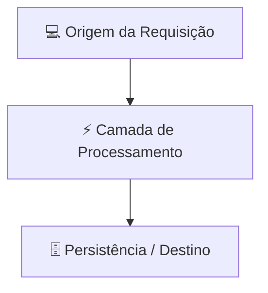

# ✍️ Skill: Escrita de Guias Reexplicados

Esta skill detalha as diretrizes de redação técnica para transformar tópicos complexos em guias reexplicados de alto nível para desenvolvedores e arquitetos.

---

## 🎯 1. Princípios Fundamentais

1. **Curadoria Oficial Baseada em Fatos**: Nada é inventado. Todo conteúdo é fundamentado em documentações oficiais autoritativas (ex.: Docker Docs, Git SCM, GitHub Docs, Cloudflare Docs, Node.js, Linux Kernel Docs).
2. **Arquitetura Antes dos Comandos**: Explique o fluxo de dados e os blocos internos com diagramas Mermaid antes de listar sintaxes.
3. **Sem Exemplos Simplistas**: Rejeitamos "Hello World" infantis. Apresente arquiteturas completas com múltiplos serviços, isolamento de rede, healthchecks e execução com usuários non-root.
4. **Identidade Visual com Beautiful Icons**: Utilize ícones elegantes em todos os títulos, seções e destaques visuais.
5. **Espelhamento Bilíngue Rigoroso**: Toda página criada em `content/pt-br/` deve ter sua réplica equivalente em `content/en/`.

---

## 📝 2. Estrutura Padrão de uma Nota Técnica

```markdown
---
title: "Título Conciso com Beautiful Icon"
author: "Pedro Andrade & Everton"
publish: true
description: "Resumo executivo de 1 a 2 frases para pré-visualização e SEO."
order: 10
tags:
  - tag-primaria
  - tag-secundaria
---

# 🚀 Título Principal da Tecnologia

> [!NOTE]
> Resumo conceitual em destaque explicando a relevância técnica e o problema que este componente resolve.

---

## 🏗️ 1. Arquitetura & Mecânica Interna



Explicação detalhada do comportamento sob o capô.

---

## 💻 2. Guia Prático & Configuração de Produção

```yaml
# Configuração real comentada pronta para ambiente de produção
version: "3.8"
services:
  app:
    image: node:22-alpine
    restart: always
```

---

## ⚠️ 3. Armadilhas Comuns & Como Evitar

- **Armadilha 1**: Descrição do erro frequente e a solução preventiva.
- **Armadilha 2**: Impacto de segurança/performance e boa prática recomendada.

---

## 📚 4. Documentação Original & Fontes de Referência

- 🌐 [Documentação Oficial](https://...) — Referência autoritativa da ferramenta.
- 📦 [Repositório / Especificação](https://...) — Código-fonte e padrões abertos.

---

## 🔗 Conexões do Segundo Cérebro

- [[pt-br/caminho/nota-relacionada|Nome da Conexão 1]]
- [[pt-br/caminho/outra-nota|Nome da Conexão 2]]
```

---

## 🔍 Checklist de Validação do Conteúdo

- [ ] A nota possui frontmatter com `title`, `author`, `publish: true`, `description`, `order` e `tags`?
- [ ] Possui beautiful icons no título e nos subtópicos?
- [ ] O diagrama Mermaid utiliza aspas duplas em todos os nós?
- [ ] Contém a seção `## 📚 Documentação Original & Fontes de Referência` com links oficiais?
- [ ] A versão espelhada em inglês foi criada em `content/en/` com o mesmo slug?
